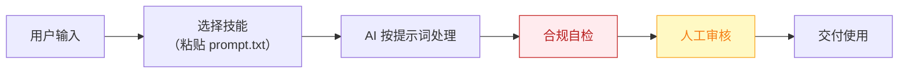

# 商品视觉师 — 业务架构

## 四层视图

```mermaid
flowchart TD
    subgraph L1["① 用户层"]
        U["月上新 5-50 款的四平台一人店/夫妻店"]
    end

    subgraph L2["② 数字员工层"]
        E["商品视觉师<br/>一人店的"到岗美工"，只出能直接上架的合规商品图"]
    end

    subgraph L3["③ 工作流层（5 条）"]
        W1["商品图批量生成与质检"]
        WN["…共 5 条"]
    end

    subgraph L4["④ 原子技能层（6 个）"]
        SK1["白底图生成"]
        SK2["场景图合成"]
        SK3["产品保真校验"]
        SK4["平台合规预审"]
        SK5["文案排版"]
        SK6["AI 模特换装"]
    end

    U -->|"提出需求"| E
    E -->|"编排调用"| W1
    W1 --> WN
    W1 --> SK1

    style L1 fill:#E8F4FD,stroke:#1976D2,color:#0D47A1
    style L2 fill:#FFF3E0,stroke:#E65100,color:#BF360C
    style L3 fill:#F3E5F5,stroke:#7B1FA2,color:#4A148C
    style L4 fill:#E8F5E9,stroke:#388E3C,color:#1B5E20
```

## 资产形态说明

本资产包为**纯提示词客户端资产**：

| 特性 | 说明 |
|------|------|
| 无运行时依赖 | 不调用任何模型 API，不需要 API Key |
| 平台无关 | 提示词为纯文本，可导入任意主流 AI 平台 |
| 用户自备算力 | 模型由用户自己的订阅提供 |
| 零服务端成本 | 资产方不产生任何调用费用 |

## 数据流



> **关键设计**：所有对外输出必须经过「合规自检 → 人工审核」双闸门。

## 能力边界

| 维度 | 内容 |
|------|------|
| **目标用户** | 月上新 5-50 款的四平台一人店/夫妻店 |
| **做** | 商品图生成、质检、合规预审、多平台适配 |
| **不做** | 不做：品牌 VI、仿冒与虚假功效图 |
| **KPI** | 一次过审率 ≥90%；单张交付 ≤5 分钟；返工率 ≤10% |
| **定价** | 30-100 元/月 |

---

*本图由 build_p0_assets.py 自动生成*
