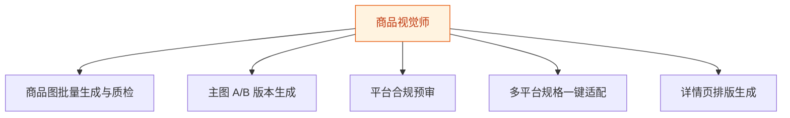

# 商品视觉师 — 工作流流程图

本员工共 **5 条工作流**，下辖 **6 个原子技能**。

## 总览

## 分条详情

### 商品图批量生成与质检

| 项目 | 内容 |
|------|------|
| 触发 | 人工 |
| 复杂度 | `M` |
| 阶段 | `P0` |
| ROI | 月省 15h≈¥450 |

### 主图 A/B 版本生成

| 项目 | 内容 |
|------|------|
| 触发 | 人工 |
| 复杂度 | `S` |
| 阶段 | `P0` |
| ROI | 替代外包 ¥300/张 |

### 平台合规预审

| 项目 | 内容 |
|------|------|
| 触发 | 事件（出图完成） |
| 复杂度 | `S` |
| 阶段 | `P0` |
| ROI | 避免扣分限流的隐性损失 |

### 多平台规格一键适配

| 项目 | 内容 |
|------|------|
| 触发 | 事件（新品上架） |
| 复杂度 | `M` |
| 阶段 | `P1` |
| ROI | 月省 6h≈¥180 |

### 详情页排版生成

| 项目 | 内容 |
|------|------|
| 触发 | 人工 |
| 复杂度 | `M` |
| 阶段 | `P1` |
| ROI | 替代外包 ¥1500/套 |

## 汇总表

| # | 工作流 | 阶段 | 复杂度 | 触发 | 涉及技能数 |
|---|--------|------|--------|------|-----------|
| 1 | 商品图批量生成与质检 | `P0` | `M` | 人工 | 3 |
| 2 | 主图 A/B 版本生成 | `P0` | `S` | 人工 | 2 |
| 3 | 平台合规预审 | `P0` | `S` | 事件（出图完成） | 1 |
| 4 | 多平台规格一键适配 | `P1` | `M` | 事件（新品上架） | 1 |
| 5 | 详情页排版生成 | `P1` | `M` | 人工 | 2 |

---

*本图由 build_p0_assets.py 自动生成*
