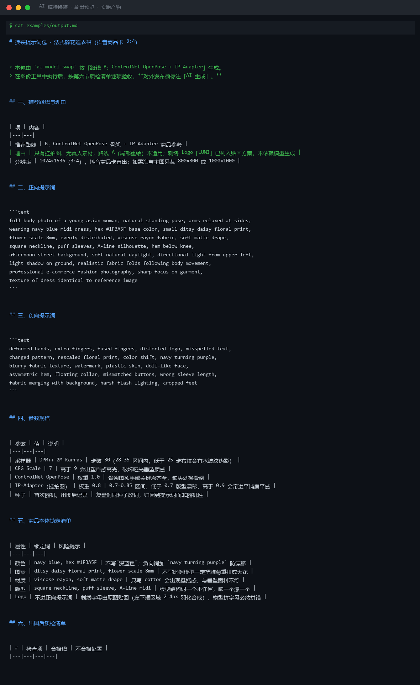
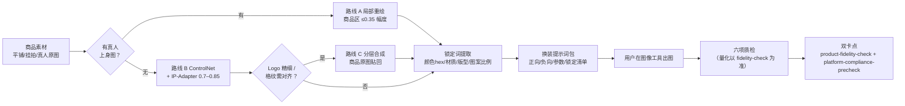

# AI 模特换装 AI Model Swap

> 原子技能 ｜ 属于「商品视觉师」 ｜ 电商小卖家客群 ｜ T2 提示词资产（输出提示词包）
>
> **把平铺图/挂拍图变成可直接投喂图像模型的换装提示词包——换的是模特和背景，不是商品。**
> 三条技术路线按商品类型选择（局部重绘 / ControlNet / 分层合成） · 重绘幅度四档管控（商品覆盖区 ≤0.35）
> 五类商品本体锁定词逐项必填（颜色 hex/材质/版型/图案比例/Logo） · 出图后六项质检清单
> 行业红线：AI 换装最常见的翻车不是「画得不像模特」，是按概率重绘时把商品顺手改了



🎬 **[▶ 观看演示视频（在线播放）](https://cdn.jsdelivr.net/gh/bangwozuo/product-visual-zh@main/skills/ai-model-swap/docs/assets/demo.mp4) · [GitHub 页](https://github.com/bangwozuo/product-visual-zh/blob/main/skills/ai-model-swap/docs/assets/demo.mp4)** — 四幕创作叙事：业务钩子 → 真实执行 → 要点到成稿演变 → 交付物

*上图来自实跑产物：本资产为纯提示词技能（无脚本），展示 `examples/output.md`——法式碎花连衣裙（抖音 3:4）的完整换装提示词包，走路线 B（ControlNet OpenPose + IP-Adapter 0.8）。*

---

## 它做什么（三条技术路线，按商品类型选择，不混用）

| 路线 | 适用 | 关键参数 | 商品保真度 |
|---|---|---|---|
| **A 局部重绘（inpainting）** | 已有真人上身图，换脸/换姿势/换背景 | 蒙版只涂允许重绘区，商品区留蒙版外；换脸 0.40–0.55 / 换手 0.45–0.60 / 换背景 0.60–0.75；**商品覆盖区任何情况下 ≤0.35** | 最保商品，优先用 |
| **B ControlNet 姿态迁移** | 只有平铺/挂拍图，从零生成上身 | OpenPose 锁骨架（手部关键点缺失直接放弃）；IP-Adapter 喂商品图权重 0.7–0.85；Canny 叠加 0.5–0.6 锁领口/门襟 | 中，靠锁定词兜底 |
| **C 分部位分层合成** | Logo 精细、格纹/条纹必须对齐的高客单价商品 | 模特底图 → 商品原图贴回衣身区 → 贴边 2–4px 羽化 | 商品区 100% 原图像素，零漂移 |

### 商品本体锁定词（提示词包的核心，逐项必填）

| 属性 | 锁定写法 | 不写的后果 |
|---|---|---|
| 颜色 | 具体色名 + hex（`navy blue dress, hex #1F3A5F`） | 写「深色」模型漂成藏青偏紫 |
| 材质 | 织法与光泽（`viscose rayon, soft matte drape`） | 真丝只写 silk 会被给成缎面高光 |
| 版型 | 结构词逐个列（`A-line midi dress, puff sleeve, square neckline`） | 缺一个漂一个 |
| 图案 | 写比例（`gingham check pattern, aligned at seams` / `scale 8-10mm`） | **图案比例不写，模型一定重排** |
| Logo | 不进正向提示词，严禁让模型生成文字 | 模型拼字母必然拼错——走贴回原图 |

### 出图后六项质检清单（逐项过，有一项不过就回炉）

| # | 检查项 | 合格线 | 不合格处置 |
|---|---|---|---|
| 1 | 颜色一致性 | ΔE00 < 3.0（以 `product-fidelity-check` 实测为准） | 路线 A 降重绘幅度重出 |
| 2 | 图案/格纹 | 对缝连续、比例与实物一致 | 补 `aligned pattern` + IP-Adapter 降至 0.75 |
| 3 | Logo/文字 | 字形笔画与原图完全一致 | 放弃 AI 生成，走路线 C 贴回 |
| 4 | 版型结构 | 领型/袖型/裙长与描述一致 | 补结构词重出 |
| 5 | 模特手部 | 五指齐全、无融合 | 换骨架图或 inpaint 手部 |
| 6 | 接缝区 | 脖颈/手腕过渡自然无色阶 | 蒙版羽化调至 8–12px 重出 |

**质检口径**：颜色与结构的量化判定以 `product-fidelity-check` 脚本输出为准——ΔE00 3.9 和 6.1 肉眼难分，但一个是警告一个是返工。

## 真实输入 → 真实输出

**输入**（`examples/input.json`）：

```json
{
  "product_info": "法式碎花连衣裙：藏青底小雏菊碎花（图案直径约 8mm），面料人造棉……左下摆处有刺绣小 Logo「LUMI」",
  "requirement": "目前只有挂拍图，无真人素材；目标平台抖音商品卡，需要 3:4 比例……",
  "model_brief": "亚洲女性，25 岁左右，标准体型，正面全身站姿，双手自然下垂"
}
```

**输出**（实跑产物节选，完整见 [`examples/output.md`](examples/output.md)）：

| 项 | 内容 |
|---|---|
| 推荐路线 | B：ControlNet OpenPose 骨架 + IP-Adapter 商品参考（无真人素材，A 不适用） |
| 分辨率 | 1024×1536（3:4），抖音商品卡直出；淘宝主图另裁 800×800 |
| 关键参数 | DPM++ 2M Karras / 30 步 / CFG 7 / IP-Adapter 0.8 |

正向提示词节选（完整可复制）：

```text
full body photo of a young asian woman, natural standing pose, ...
wearing navy blue midi dress, hex #1F3A5F base color,
small ditsy daisy floral print, flower scale 8mm, evenly distributed, ...
```

商品锁定清单节选：颜色 navy blue, hex #1F3A5F（负向词加 `navy turning purple` 防漂移）；图案 flower scale 8mm（不写比例模型一定把雏菊重排成大花）；Logo「LUMI」不进正向提示词——刺绣字母由原图贴回（左下摆区域 2–4px 羽化合成）。

## 处理流水线



## 快速开始

```text
1. 打开 prompt.txt，全文复制
2. 粘贴到 Coze / WorkBuddy / Dify / Claude / ChatGPT
3. 按 schema.json 输入规格提供：商品信息（材质/颜色/图案/Logo 细节）
   + 需求（现有素材/目标平台/模特要求）
4. 拿提示词包到图像工具（SD+ControlNet / MJ / 即梦 / 可灵）出图，
   按第六节质检清单逐项验收，记录种子
```

## 该用 / 别用

| ✅ 该用 | ❌ 别用 |
|---|---|
| 无真人模特资源的服饰类目出图（省一次棚拍） | 用 AI 换装图冒充买家秀 / 暗示「真人试穿实拍」 |
| 换模特、换背景、换姿势——商品本体不动 | 「改色/改材质/改版型」的优化请求（那是另一款商品，一律拒绝） |
| 高客单价商品走路线 C 兜底（Logo 零风险） | 让模型生成 Logo 文字/品牌名拼写（必然拼错） |
| 提供商品实拍图与参数后出方案 | 用户没给商品参数时编造颜色/材质/图案（列清单索取） |
| 上架前过保真 + 合规双卡点 | 为「规避 AI 检测」提供任何技巧 |

## 边界与合规

- 本资产输出为 **AI 辅助生成内容**：按《互联网信息服务深度合成管理规定》第十六条与平台规则，生成图须标注「AI 生成」；抖音发布侧声明开关必须开启
- 用真人原图换装须取得本人授权，只换背景不换脸也建议留授权记录
- 模特体型不得用于暗示穿者身材效果（如「显瘦 10 斤」无依据）
- 出图不承诺效果——本资产交付提示词包与质检标准，实际出图由用户在图像工具执行

## 文件地图

```text
├── README.md                ← 本文件
├── SKILL.md                 ← 资产定义（元信息 / 契约 / 边界）
├── prompt.txt               ← 提示词本体（三条路线 + 锁定词 + 六项质检 + 输出格式）
├── schema.json              ← 输入输出契约（机器可读）
├── examples/                ← 真实输入 + 实跑输出（碎花连衣裙提示词包）
├── docs/                    ← 9 项配套文档（架构 / 流程 / 场景 / 测试报告…）
└── out/                     ← 运行产物（本资产无脚本，产物为提示词包文档）
```

---

*本资产遵循 [bangwozuo 数字员工资产规范](https://github.com/bangwozuo/digital-employee-spec) v3.0 ｜ [所属员工：商品视觉师](../../) ｜ [总入口](https://github.com/bangwozuo/digital-employees-hub-zh)*
