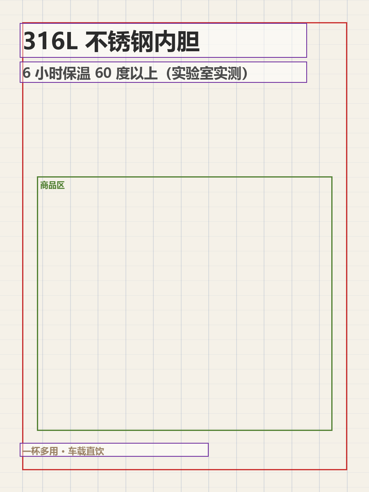
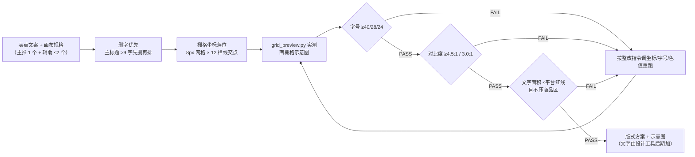

# 文案排版 Copy Layout

> 原子技能 ｜ 属于「商品视觉师」 ｜ 电商小卖家客群 ｜ T2 提示词 + 栅格脚本（交付真实文件）
>
> **把卖点文案排进画面——8px 栅格 + 三级字号底线 + WCAG 对比度实测，让 150px 缩略图上仍有一个利益点被看清。**
> 8px 基准网格 / 12 栏栅格 · 三级字号封顶（40/28/24px） · 对比度脚本实测（正文 ≥4.5:1）
> 平台文字面积红线（抖音 ≤20%、淘宝主图禁文字） · 四项量化检查 + 压商品区检测


🎬 **[▶ 观看演示视频（在线播放）](https://cdn.jsdelivr.net/gh/bangwozuo/product-visual-zh@main/skills/copy-layout/docs/assets/demo.mp4) · [GitHub 页](https://github.com/bangwozuo/product-visual-zh/blob/main/skills/copy-layout/docs/assets/demo.mp4)** — 四幕创作叙事：业务钩子 → 真实执行 → 要点到成稿演变 → 交付物

*上图来自真实执行：`python scripts/grid_preview.py --demo`，900×1200 抖音商品卡方案，文字面积 10.2%（上限 20%），主标题对比度 12.56:1 通过、卖点条 22px 不达标 → 判定「需整改」并输出整改指令。*

---

## 它做什么（四层版式方法论，逐层定参）

**为什么版式值得单独一个技能**：主图在手机列表页实际显示宽度只有 150–200px，800px 原图要缩到约 1/4——16px 小字直接糊成一团。卖点图是**在 3 秒滑动的注意力窗口里让一个利益点被看清**。

### 1. 栅格系统（脚本按此画格子）

| 项 | 规则 | 说明 |
|---|---|---|
| 基准网格 | 8px | 所有坐标、字号、间距取 8 的倍数，避免亚像素模糊 |
| 栏数 | 12 栏，栏间距 16px | 文字块必须对齐栏线，禁止自由摆放 |
| 安全边距 | 短边的 6%（900 宽 → 54px） | 贴边文字会被平台圆角裁掉 |
| 黄金区 | 上 1/3 至中线的左 2/3 | F 型视线落点，主卖点放这里 |
| 视觉动线 | 卖点图 Z 型 / 详情模块 F 型 | 一张图只有一条动线 |

### 2. 文字层级（三级封顶，每级有最小字号）

| 层级 | 字号（800 基准） | 用途 | 限制 |
|---|---|---|---|
| 主标题 | ≥40px（画布宽 5%） | 一个利益点 | ≤9 字，每张图只有 1 个 |
| 副标题 | ≥28px（3.5%） | 规格/场景补充 | ≤14 字，可选 |
| 卖点条 | ≥24px（3%） | 辅助卖点 | 最多 2 条——再多缩略图上全是蚂蚁线 |

**为什么最小 24px**：列表页缩略比约 4:1，24px 缩后剩 6px——人眼辨认中文需要 ≥5px。

### 3. 对比度与配色（脚本实测，不靠感觉）

- WCAG 相对亮度比：正文 ≥4.5:1，大标题（≥40px 粗体）≥3.0:1
- 画面用色 ≤3 种；强调色只给主卖点；商品主色与强调色避免同色系（红商品配红标签=标签隐身）

### 4. 文字面积与平台红线

| 平台/用途 | 文字面积上限 | 其他 |
|---|---|---|
| 淘宝/天猫主图 | 除品牌 Logo 外**不得加文字** | 利益点全部移到第 2–5 张 |
| 抖音商品卡 | 文字 ≤画面面积 20% | 脚本实测文字块占比 |
| 小红书配图 | 无硬性比例 | 安全边距加大到 8% |
| 详情页模块 | 无硬性比例 | 每屏 1 个卖点，长图总高 ≤8000px |

## 真实输入 → 真实输出

**输入**（`examples/input.json`）：便携电热水杯（316L 内胆），抖音商品卡 900×1200，3 个文字块含坐标/字号/色值。

**输出**（脚本实跑，判定 **需整改**，节选）：

| 层级 | 文案 | 字号 | 字号达标 | 对比度 | 对比达标 | 压商品区 |
|---|---|---|---|---|---|---|
| 主标题 | 316L 不锈钢内胆 | 56 | ✅ | 12.56:1 | ✅ | ✅ 无 |
| 副标题 | 6 小时保温 60 度以上（实验室实测） | 34 | ✅ | 7.86:1 | ✅ | ✅ 无 |
| 卖点条 | 一杯多用 · 车载直饮 | 22 | ❌ | 3.15:1 | ❌ | ✅ 无 |

文字面积 10.2%（上限 20%，脚本实测）。整改指令：卖点条加大到 ≥24px 并换文字色或加深色底条；三个文字块均超出 54px 安全边距，须整体内收。

版式栅格示意图（脚本实跑产物）：`out/版式栅格示意图.png`



完整报告见 [`examples/output.md`](examples/output.md)；JSON 版：`out/layout_check.json`。

## 处理流水线



## 快速开始

**方式一：提示词（任意 AI 工具）**

```text
1. 打开 prompt.txt，全文复制
2. 粘贴到 Coze / WorkBuddy / Dify / Claude / ChatGPT
3. 按 schema.json 输入规格提供：主推卖点 + 辅助卖点 + 平台/用途/画布尺寸
```

**方式二：脚本（零 AI 依赖，确定性检查）**

```bash
# 演示模式（内置真实样例）
python scripts/grid_preview.py --demo
# 指定输入
python scripts/grid_preview.py --input examples/input.json --outdir out
```

依赖：`pip install pillow openpyxl`（缺失时脚本会打印修复命令，不静默失败）。

## 该用 / 别用

| ✅ 该用 | ❌ 别用 |
|---|---|
| 主图/商品卡/详情模块的文字落位设计 | 产出可上架成品图（脚本产出的是栅格示意图） |
| 抖音 ≤20%、淘宝禁文字等平台红线自查 | 让生图模型生成汉字/Logo（必出错别字——只留区域，文字后期加） |
| 「字放哪、多大、什么色」的落地改法（带坐标/字号/色值） | 「放大一点」「换个颜色试试」类不落地建议 |
| 排版前文案合规（先过 `platform-compliance-precheck`） | 一张图塞 4 个卖点（每屏 1 主 + ≤2 辅） |

## 边界与合规

- 本资产输出为 **AI 辅助生成内容**，最终上架图须经人工确认
- 平台对牛皮癣/文字面积的规则会更新，以官方最新公示为准
- 图上不出现极限词（最、第一、100%）——排版前先过合规预审
- 用户没给商品区信息时按画面中心 55% 高度估算并标注「商品区待实测」，不假装已知

## 文件地图

```text
├── README.md                  ← 本文件
├── SKILL.md                   ← 资产定义（元信息 / 契约 / 边界）
├── prompt.txt                 ← 提示词本体（四层方法论 + 失败模式 + 输出格式）
├── schema.json                ← 输入输出契约（机器可读）
├── scripts/grid_preview.py    ← 栅格示意图 + 四项量化检查（PNG/JSON/报告）
├── examples/                  ← 真实输入 + 脚本实跑输出
├── docs/                      ← 9 项配套文档（架构 / 流程 / 场景 / 测试报告…）
└── out/                       ← 实跑产物（版式栅格示意图.png / layout_check.json / 报告）
```

---

*本资产遵循 [bangwozuo 数字员工资产规范](https://github.com/bangwozuo/digital-employee-spec) v3.0 ｜ [所属员工：商品视觉师](../../) ｜ [总入口](https://github.com/bangwozuo/digital-employees-hub-zh)*
