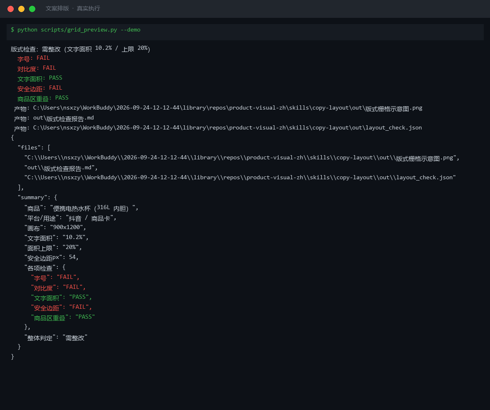

# 截图与录屏

> 以下素材均来自**真实执行**：`--run` 实拍终端 / 实跑产物文件，无摆拍。

## 演示视频


*Hyperframes 动态渲染 15s：命令逐字敲入（光标闪烁）→ 21 行真实输出逐行流式 → 实跑产物 Ken Burns 缓推*

## 执行截图



## 实跑产物

| 文件 | 说明 |
|---|---|
| [`out/layout_check.json`](out/layout_check.json) | 结构化结果（实跑生成） · 1 KB |
| [`out/版式栅格示意图.png`](out/版式栅格示意图.png) | 图表产物（实跑生成） · 40 KB |
| [`out/版式检查报告.md`](out/版式检查报告.md) | Markdown 报告（实跑生成） · 1 KB |


---

## 附录：实跑输出明细

> 本资产为纯提示词客户端资产，无界面可截图。以下为**实跑运行效果**。

## 运行效果

### 输入

```json
{
  "product_info": "商品名称：示例商品；主要卖点：轻便、耐用",
  "requirement": "白底图，800x800，用于主图"
}

```

### 输出

## 生成提示词

正向提示词：
E-commerce product layout design, lightweight and durable item featured with selling points overlay, clean grid-based composition, white background, professional typography, minimal modern style, balanced text and image ratio, Chinese commercial design, clear visual hierarchy, 800x800 pixels, crisp edges, studio lighting

## 负面提示词

cluttered layout, illegible text, clashing colors, distorted perspective, busy background, watermark, frame, casual handwriting font, excessive decoration, off-center product, blurry text, overlapping elements, unbalanced composition

## 质检标准

1. 版式采用栅格系统，元素对齐整齐
2. 卖点文字清晰可读，字号层级分明
3. 产品图与文案比例协调，不遮挡主体
4. 配色简洁专业，符合电商视觉规范
5. 输出尺寸严格为 800x800
6. 无违规极限词或虚假宣传表述

## 执行说明

本资产只产出指令，实际出图需用户在图像工具中执行。输出内容已标注「AI 生成内容」。


---

*运行效果由实跑验证生成*
