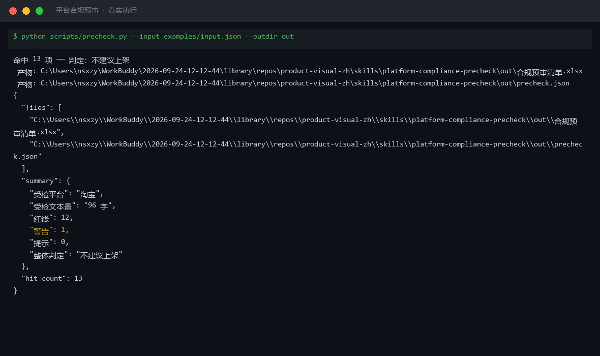
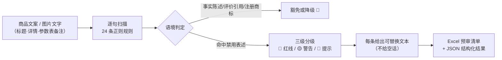

# 平台合规预审 Platform Compliance Precheck

> 原子技能 ｜ 属于「商品视觉师」 ｜ 电商小卖家客群 ｜ T1 产物型（脚本交付真实文件）
>
> **上架前把会被下架、限流、扣分的表述挑出来，并给出可直接替换的改法。**
> 脚本内置 24 条正则规则 · 覆盖《广告法》三大词类 + 7 个类目禁用词 + 3 类平台规则 · 一次扫描输出 Excel 预审清单




🎬 **[▶ 观看高清完整版（mp4）](https://cdn.jsdelivr.net/gh/bangwozuo/product-visual-zh@main/skills/platform-compliance-precheck/docs/assets/demo.mp4)** — 四幕检测叙事：业务钩子 → 真实执行 → 检查项逐条亮灯 → 交付物

*上图来自真实执行：96 字待检文案命中 13 项（红线 12 / 警告 1），判定「不建议上架」，产物落盘 Excel + JSON。*

---

## 它查什么（三类规则，逐类扫描）

### 一类：绝对化用语（《广告法》第九条，必驳回）

| 词组 | 例词 |
|---|---|
| 最高级类 | 最、最佳、最低价、最便宜、最先进 |
| 排名类 | 第一、销量第一、TOP1、冠军、领导者 |
| 唯一类 | 唯一、独家、首创、首款、空前绝后 |
| 级别类 | 国家级、世界级、顶级、极品、至尊 |
| 功效断言 | 100%、彻底、根治、绝对安全、无任何副作用 |

### 二类：类目特有禁用词（按类目启用）

| 类目 | 禁用表述示例 | 依据 |
|---|---|---|
| 化妆品 | 治疗、疗效、消炎、抗敏、药妆、医学级 | 《化妆品监督管理条例》第 22 条 |
| 食品 | 降血压、降血糖、抗癌、减肥、排毒 | 《食品安全法》第 73 条 |
| 教育 | 保过、包就业、100% 提分 | 《广告法》第 24 条 |
| 金融 | 保本、稳赚、零风险、日入过万 | 《广告法》第 25 条 |
| 母婴 / 保健品 / 医疗器械 | 无依据的「最安全 / 无添加 / 疗效」 | 需检测报告或注册证号 |

### 三类：平台特有规则（"牛皮癣"与导流）

- **淘宝/天猫主图**：除品牌 Logo 外不得添加任何文字与边框
- **抖音商品卡**：主图文字面积 ≤ 图片面积 20%
- **小红书**：配图不得含微信号、二维码、外链导流
- **诱导性表述**：诱导好评、虚假促销、虚构原价；**资质类**：特殊类目未公示许可证

## 三级判定

| 级别 | 含义 | 处理 |
|---|---|---|
| 🔴 红线 | 法定禁止或平台明确驳回 | **必须改**，给出替换写法 |
| 🟡 警告 | 高概率触发限流/扣分 | 给出保守写法 |
| 🔵 提示 | 需补充证明材料才可用 | 说明需什么材料 |

**语境豁免**（不误报）：「最新款 iPhone 手机壳」属事实陈述；「第一眼就喜欢」属用户评价引用（仍标 🟡）；注册商标含禁用词标 🔵 建议附商标证明；「无添加」有第三方检测报告只标 🔵 补报告编号。

## 真实输入 → 真实输出

**输入**（`examples/input.json`）：

```json
{
  "text": "全网最低价！国家级工艺，独家配方，100% 彻底抗敏，最好的母婴专用洗衣液，销量第一",
  "platform": "淘宝",
  "category": "母婴"
}
```

**输出**（脚本实跑，命中 13 项，节选）：

| # | 级别 | 原文片段 | 命中规则 | 依据 | 建议改法 |
|---|---|---|---|---|---|
| 1 | 🔴 | 100% | 绝对化用语·功效断言 | 《广告法》第九条 | 改为「实测反馈良好（样本 30 人）」 |
| 4 | 🔴 | 抗敏 | 化妆品·医疗宣称 | 《化妆品监督管理条例》第 22 条 | 改为「护理」「舒缓」等非医疗用词 |
| 7 | 🔴 | 独家 | 绝对化用语·唯一性 | 《广告法》第九条 | 有专利可改「已获专利 ZL…」（附专利号） |
| 8 | 🔴 | 第一 | 绝对化用语·排名 | 《广告法》第九条 | 改「店铺热销单品」并注明数据口径 |

完整 13 条见 [`examples/output.md`](examples/output.md)；Excel 版产物：`out/合规预审清单.xlsx`（预审结论 + 违规明细 + 修改建议三个 sheet）。

## 处理流水线



## 快速开始

**方式一：提示词（任意 AI 工具）**

```text
1. 打开 prompt.txt，全文复制
2. 粘贴到 Coze / WorkBuddy / Dify / Claude / ChatGPT
3. 按 schema.json 的输入规格提供：待检文案 + 目标平台 + 类目
```

**方式二：脚本（零 AI 依赖，确定性扫描）**

```bash
# 演示模式（内置真实样例）
python scripts/precheck.py --demo
# 指定输入
python scripts/precheck.py --input examples/input.json --outdir out
```

依赖：`pip install openpyxl`（缺失时脚本会打印修复命令，不静默失败）。

## 面向谁 / 什么时候用

| ✅ 该用 | ❌ 别用 |
|---|---|
| 商品上架前的最后一道文案/主图检查 | 替代法律意见（规则以平台官方公示为准） |
| 批量 SKU 上架前的批量预筛（脚本模式） | 100% 准确零人工（AI 预审必须人工复核） |
| 改词无头绪，要可直接替换的改法 | 抓取需登录的私域数据做审查 |

## 边界与合规

- 本资产输出为 **AI 辅助生成内容**，交付前必须人工审核，并按平台要求完成 AI 内容标识
- 平台规则每月可能更新，**上架前请对照平台官方最新规范二次确认**
- 不构成法律意见；不抓取登录态数据；连接器只走官方 API 与用户自行导出数据

## 文件地图

```text
├── README.md                ← 本文件
├── SKILL.md                 ← 资产定义（元信息 / 契约 / 边界）
├── prompt.txt               ← 提示词本体（三类规则 + 语境豁免 + 输出格式）
├── schema.json              ← 输入输出契约（机器可读）
├── scripts/precheck.py      ← 确定性扫描脚本（24 条规则 → Excel/JSON）
├── examples/                ← 真实输入 + 脚本实跑输出
├── docs/                    ← 9 项配套文档（架构 / 流程 / 场景 / 测试报告…）
└── out/                     ← 实跑产物（合规预审清单.xlsx / precheck.json）
```

---

*本资产遵循 [bangwozuo 数字员工资产规范](https://github.com/bangwozuo/digital-employee-spec) v3.0 ｜ [所属员工：商品视觉师](../../) ｜ [总入口](https://github.com/bangwozuo/digital-employees-hub-zh)*
