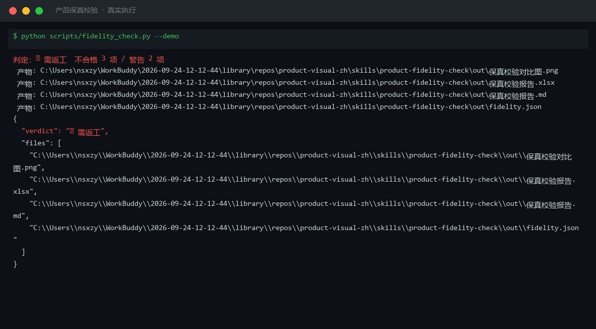
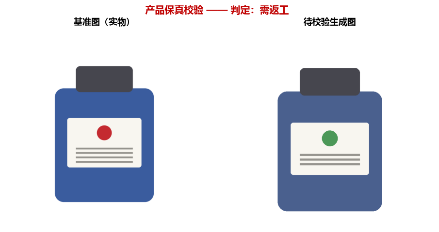
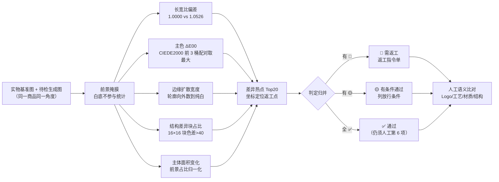

# 产品保真校验 Product Fidelity Check

> 原子技能 ｜ 属于「商品视觉师」 ｜ 电商小卖家客群 ｜ T1 产物型（脚本交付真实文件）
>
> **拿实物图当基准，检查 AI 生成图有没有偷改商品本体——出的是返工指令单，不是「我觉得挺像」。**
> 六维量化校验（CIEDE2000 色差 / 边缘扩散宽度 / 结构差异块 / 长宽比 / 主体面积 / 语义人工）
> 8 类会直接算错的领域失败模式拦截 · 差异热点坐标定位「哪里被改了」· 发布前硬卡点




🎬 **[▶ 观看高清完整版（mp4）](https://cdn.jsdelivr.net/gh/bangwozuo/product-visual-zh@main/skills/product-fidelity-check/docs/assets/demo.mp4)** — 四幕检测叙事：业务钩子 → 真实执行 → 检查项逐条亮灯 → 交付物

*上图来自真实执行：`python scripts/fidelity_check.py --demo`，800×800 实物基准图 vs 800×760 生成图（1× 直出、Logo 被 AI 画成绿色），判定 🔴 需返工，对比图 + 报告落盘。*

---

## 它查什么（六个校验维度，口径全部可量化）

| # | 指标 | 合格线 | 为什么这么测 |
|---|---|---|---|
| 1 | 长宽比偏差 | ≤1.0% ✅ / 1–3% 🟡 / >3% 🔴 | 抓「压扁/拉长」——平台算法与肉眼均无感的变形带 |
| 2 | 主色 ΔE00（CIEDE2000） | <1.0 不可辨 / 2.0–3.0 🟡 / >6.0 视为不同色 🔴 | **不用 RGB 欧氏距离**——与人眼感受不成比例，深蓝偏移被放大、亮黄被缩小 |
| 3 | 边缘扩散宽度 W | ≥0.5px ✅ / 0.2–0.5 🟡 / <0.2px 🔴 | 抓硬边 staircase；**不用「周长/等效圆周长」判锯齿**——长方形商品天然偏高会误报 |
| 4 | 结构差异块占比（16×16 块，色差>40） | ≤2% ✅ / 2–8% 🟡 / >8% 🔴 | 定位「哪里被改了」：热点落标签区=Logo 被改，落纹理区=花型被重排 |
| 5 | 主体面积变化 | ≤1% ✅ / 1–5% 🟡 / >5% 🔴 | 抓缩放/缺失；按各自画布归一化，避免画布尺寸干扰 |
| 6 | 语义级比对（Logo 字形/工艺/材质/结构拓扑） | **必须人工逐项确认** | 脚本只能测像素；给不出结论就写「待人工确认」，不猜 |

**判定归并**：任一维度 🔴 → 整体 🔴 需返工；无 🔴 有 🟡 → 🟡 有条件通过；全 ✅ 且第 6 项过 → ✅ 通过。

**基准纪律**：基准图必须是实物原图——「上一版 AI 图」当基准，误差逐代累积放大；角度不一致时只报主色与边缘，其余标「不适用」。

## 真实输入 → 真实输出

**输入**（`examples/input.json`）：玻璃瓶精华液 30ml，实物基准图 800×800（4× 超采样）vs 生成图 800×760（1× 直出、瓶身偏青、Logo 被画成绿色、纹理条少一条）。

**输出**（脚本实跑，判定 🔴 需返工，节选）：

| # | 指标 | 实测值 | 判定 |
|---|---|---|---|
| 1 | 长宽比偏差 | 5.26% | 🔴 不合格 |
| 2 | 主色 ΔE00（最大） | 4.33 | 🟡 警告 |
| 3 | 边缘扩散宽度 | 0.0000px | 🔴 不合格 |
| 4 | 结构差异块占比 | 31.76%（215/677 块） | 🔴 不合格 |
| 5 | 主体面积变化 | 3.65% | 🟡 警告 |
| 6 | 语义级比对 | 待人工确认 | — |

主色比对节选（CIEDE2000，前景掩膜内逐桶配对）：基准 RGB(58,92,158) vs 生成 RGB(74,96,142)，**ΔE00 4.33**——瓶身偏青，肉眼难辨但已过警告线。

返工指令节选：① 画布改回基准比例等比重导出；② 4× 超采样后降采样或蒙版 0.5–1px 羽化；③ 按热点坐标（x=248–392, y=704–728 区域）对照实物重绘。

对比图（脚本实跑产物）：`out/保真校验对比图.png`



完整报告见 [`examples/output.md`](examples/output.md)；Excel 版：`out/保真校验报告.xlsx`。

## 处理流水线



## 快速开始

**方式一：提示词（任意 AI 工具）**

```text
1. 打开 prompt.txt，全文复制
2. 粘贴到 Coze / WorkBuddy / Dify / Claude / ChatGPT
3. 按 schema.json 输入规格提供：基准图 + 生成图 + 商品名（数值填「待脚本实测」）
```

**方式二：脚本（零 AI 依赖，确定性测量）**

```bash
# 演示模式（内置真实样例：偏色 + 变形 + 硬边生成图）
python scripts/fidelity_check.py --demo
# 指定图片
python scripts/fidelity_check.py --real examples/assets/demo_ref.png --gen examples/assets/demo_gen.png --outdir out
```

依赖：`pip install pillow openpyxl`（缺失时脚本会打印修复命令，不静默失败）。

## 该用 / 别用

| ✅ 该用 | ❌ 别用 |
|---|---|
| AI 生成图 / 修图成品上架前的保真硬卡点 | 替代人工比对实物（语义级 4 项必须人眼） |
| 「看着差不多」的量化裁决（3.9 与 6.1 肉眼难分，一个警告一个返工） | 基准图用上一版 AI 图（误差逐代累积） |
| 批量出图后的逐张质检（接入 `product-image-batch-qc-flow` 抽样判定） | 陶瓷/珍珠白等近纯白主体给边缘结论（掩膜失效须先手工描边） |
| 差异热点定位返工区域（不用整图重做） | 基准图与生成图角度不同时报长宽比/结构结论 |

## 边界与合规

- 本资产输出为 **AI 辅助生成内容**，报告头写明「像素指标来自脚本实测」，结论须人工复核后方可用于上架决策
- 保真校验是《广告法》第 28 条防虚假宣传的硬卡点，**不能替代**人工比对实物
- 不因校验结果建议修改商品描述去迁就生成图（属虚假宣传风险）；要改的是图，不是实物描述
- 涉及质量争议时，以实物与平台规则为准

## 文件地图

```text
├── README.md                    ← 本文件
├── SKILL.md                     ← 资产定义（元信息 / 契约 / 边界）
├── prompt.txt                   ← 提示词本体（六维口径 + 失败模式 + 报告格式）
├── schema.json                  ← 输入输出契约（机器可读）
├── scripts/fidelity_check.py    ← 六维测量脚本（CIEDE2000 → 对比图/Excel/JSON）
├── examples/                    ← 真实输入（基准图/生成图）+ 脚本实跑输出
├── docs/                        ← 9 项配套文档（架构 / 流程 / 场景 / 测试报告…）
└── out/                         ← 实跑产物（保真校验对比图.png / fidelity.json / 报告）
```

---

*本资产遵循 [bangwozuo 数字员工资产规范](https://github.com/bangwozuo/digital-employee-spec) v3.0 ｜ [所属员工：商品视觉师](../../) ｜ [总入口](https://github.com/bangwozuo/digital-employees-hub-zh)*
