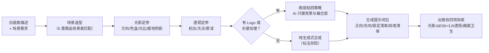

# 场景图合成 Scene Image Compose

> 原子技能 ｜ 属于「商品视觉师」 ｜ 电商小卖家客群 ｜ T2 提示词资产（输出提示词包）
>
> **把白底商品图放进真实使用场景，让商品接受场景的光照法则——而不是「贴上去」。**
> 光影四参数缺一不可（方向/色温/光比/接地阴影） · 透视三生死线（机位差 ≤15°/灭点/景深）
> 5 类商品场景选型表 · 6 类假阳性失败模式排查 · 量化验收交给 `product-fidelity-check`


*上图来自实跑产物：本资产为纯提示词技能（无脚本），展示 `examples/output.md`——不锈钢摩卡壶「厨房晨光」场景的完整合成提示词包。*

---

## 它做什么（场景合成的两条生死线）

**为什么场景图最容易翻车**：白底图是「棚拍光」（均匀、无方向、色温 5500K），场景是「环境光」（有方向、有色温、有影子）。商品还带着棚拍的光，背景却是夕阳——人眼立刻看出「贴上去的」。

### 光影一致（第一生死线，四项参数缺一不可）

| 参数 | 怎么定 | 落进提示词的方式 |
|---|---|---|
| 光源方向 | 看场景图主影子方向，商品高光必须同侧 | `soft daylight from upper left` |
| 色温 | 晨光 ≈3500K / 正午 ≈5500K / 黄昏 ≈3000K / 阴天 ≈6500K | `warm afternoon light (3500K)`——直接写数值 |
| 光比 | 商品亮面/暗面 2:1 至 3:1，暗面不得死黑 | `gentle fill shadow, no harsh black shadow` |
| 接地阴影 | 影子与光源反向；长光源出长软影，点光源出短硬影 | `contact shadow under product, cast toward lower right` |

### 透视一致（第二生死线）

- **机位高度**：桌面商品 ≈45° 俯拍或平视；站立商品平视。**商品视角与背景视角差 >15° 就会「浮」**
- **灭点匹配**：背景直线（桌沿/瓷砖缝）消失方向必须与商品透视一致，写 `camera at product mid-height, 50mm lens` 锁机位
- **景深合理**：商品在焦平面，背景轻虚化 `f/2.8`——50mm 以下广角配大虚化会假

### 场景选型（商品必须回答「在哪里被使用」）

| 商品类型 | 高转化场景 | 避雷 |
|---|---|---|
| 厨房用品 | 木质/石材台面 + 烹饪进行时（蒸汽、食材边角料） | 空荡样板间——没有生活证据 |
| 个护美妆 | 浴室大理石 + 水珠 + 柔光 | 深色重阴影吞掉瓶身细节 |
| 电子产品 | 桌面工位 + 线材收纳 + 咖啡杯旁 | 杂物多过 3 件抢主体 |
| 户外装备 | 实地使用环境 + 人物局部 | 影棚假草假石头 |
| 家纺家居 | 卧室/客厅实景 + 自然光窗帘光 | 顶灯直射——reality 感最差的光 |

**商品锁定策略**：商品本体优先用白底图贴回（图层级合成，保真兜底）；纯生成式合成只用于无 Logo、无关键纹理的低风险商品。商品占比 40%–60%，放三分法交点、朝向留白。

## 真实输入 → 真实输出

**输入**（`examples/input.json`）：

```json
{
  "product_info": "不锈钢摩卡壶：拉丝不锈钢（hex #8C9296），八角壶身、黑色电木把手，容量 300ml，壶身无印刷 Logo，金属高光明显",
  "requirement": "厨房晨光场景：原木台面靠窗，晨光斜射带蒸汽感……目标平台抖音商品卡 900x1200（3:4）",
  "composition": "商品占比约 50%，壶嘴朝向左侧留白，45 度俯拍"
}
```

**输出**（实跑产物节选，完整见 [`examples/output.md`](examples/output.md)）：

| 项 | 内容 |
|---|---|
| 合成策略 | 图层贴回：AI 只生成背景与光照融合层，摩卡壶本体从白底图抠出后贴回 |
| 光影参数 | 方向 upper-left / 色温 3800K（晨光偏暖）/ 光比 2:1 / 接地阴影朝右下 |
| 透视参数 | 机位 45° 俯拍 / 镜头 50mm / 景深 f/2.8 背景轻虚化 |

正向提示词节选（完整可复制）：

```text
bright kitchen countertop scene at morning, warm daylight from upper left,
color temperature 3800K, light wooden countertop near a window,
scattered coffee beans and a beige linen cloth as props, gentle steam in the air,
soft contact shadows cast toward lower right, ...
brushed stainless steel moka pot, hex #8C9296, octagonal body, ...
```

商品锁定清单（节选）：壶身颜色/材质白底图贴回（本体像素 100% 原图）；金属高光不重画，AI 融合层只压暗/提亮边缘 5%–8%；八角壶身贴回时做透视变换，对角线长度比对白底图 ±3%。

## 处理流水线



## 快速开始

```text
1. 打开 prompt.txt，全文复制
2. 粘贴到 Coze / WorkBuddy / Dify / Claude / ChatGPT
3. 按 schema.json 输入规格提供：商品信息（白底图描述/材质/主色 hex/尺寸感）
   + 场景要求（场景/情绪/目标平台与画布）
4. 拿提示词包到图像工具（SD / MJ / 即梦 / 可灵）出图，按验收清单逐项检查
```

## 该用 / 别用

| ✅ 该用 | ❌ 别用 |
|---|---|
| 白底图已备好、需要场景图提转化的商品 | 无白底图无主色信息就空套方案（先索取再出方案，不猜） |
| 有 Logo / 关键纹理商品（走图层贴回策略） | 纯生成式合成硬上有 Logo 商品（Logo 必然被改） |
| 量化验收（ΔE00、结构差异交给 `product-fidelity-check` 实测） | 场景里放他人品牌、可识别人物（无授权）、竞品商品 |
| 营造真实使用感（有生活证据的场景） | 把 200ml 杯子「合」进巨型场景显大误导容量（《广告法》第 28 条） |

## 边界与合规

- 本资产输出为 **AI 辅助生成内容**：对外发布须标注「AI 生成」，不得暗示实拍
- 场景中出现人物须有肖像授权；出现第三方品牌元素须删除
- 合成场景不得制造虚假使用效果；商品容量/尺寸不得因透视被视觉夸大
- 场景图上架前过 `product-fidelity-check` 硬卡点；图上加利益点文字先过 `platform-compliance-precheck`

## 文件地图

```text
├── README.md                ← 本文件
├── SKILL.md                 ← 资产定义（元信息 / 契约 / 边界）
├── prompt.txt               ← 提示词本体（光影/透视方法论 + 失败模式 + 输出格式）
├── schema.json              ← 输入输出契约（机器可读）
├── examples/                ← 真实输入 + 实跑输出（摩卡壶晨光场景提示词包）
├── docs/                    ← 9 项配套文档（架构 / 流程 / 场景 / 测试报告…）
└── out/                     ← 运行产物（本资产无脚本，产物为提示词包文档）
```

---

*本资产遵循 [bangwozuo 数字员工资产规范](https://github.com/bangwozuo/digital-employee-spec) v3.0 ｜ [所属员工：商品视觉师](../../) ｜ [总入口](https://github.com/bangwozuo/digital-employees-hub-zh)*
