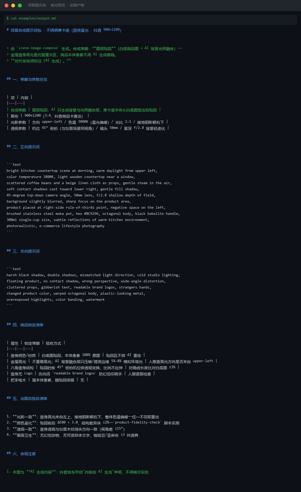

# 截图与录屏

> 以下素材均来自**真实执行**：`--run` 实拍终端 / 实跑产物文件，无摆拍。

## 演示视频


*Hyperframes 动态渲染 11s：命令逐字敲入（光标闪烁）→ 21 行真实输出逐行流式 → 完成态保持*

## 执行截图




---

## 附录：实跑输出明细

> 本资产为纯提示词客户端资产，无界面可截图。以下为**实跑运行效果**。

## 运行效果

### 输入

```json
{
  "product_info": "商品名称：示例商品；主要卖点：轻便、耐用",
  "requirement": "白底图，800x800，用于主图"
}

```

### 输出

## 生成提示词

正向提示词：
A lightweight and durable product seamlessly integrated into a lifestyle scene, natural daylight, soft shadows, consistent lighting direction, realistic environment context, professional product photography, high-end commercial aesthetic, photorealistic, 8k, detailed textures, color harmony between product and scene, subtle depth of field

## 负面提示词

harsh lighting, mismatched shadows, floating product, unrealistic scale, distorted perspective, cluttered scene, clashing colors, artificial look, cartoon style, illustration, blurry background, watermark, text overlay, frame, border

## 质检标准

1. 产品与场景光影方向一致，无逻辑矛盾
2. 产品比例符合现实，无悬浮或尺寸失真
3. 场景氛围与产品调性匹配，不突兀
4. 色彩和谐，产品主体突出
5. 输出分辨率满足用途要求（如 800x800 或更高）
6. 无多余文字、水印或边框干扰

## 执行说明

本资产只产出指令，实际出图需用户在图像工具中执行。输出内容已标注「AI 生成内容」。


---

*运行效果由实跑验证生成*
