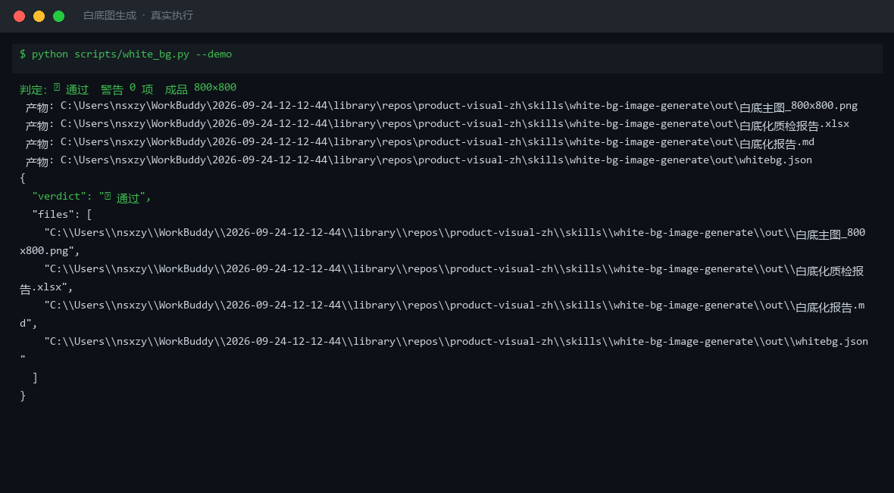
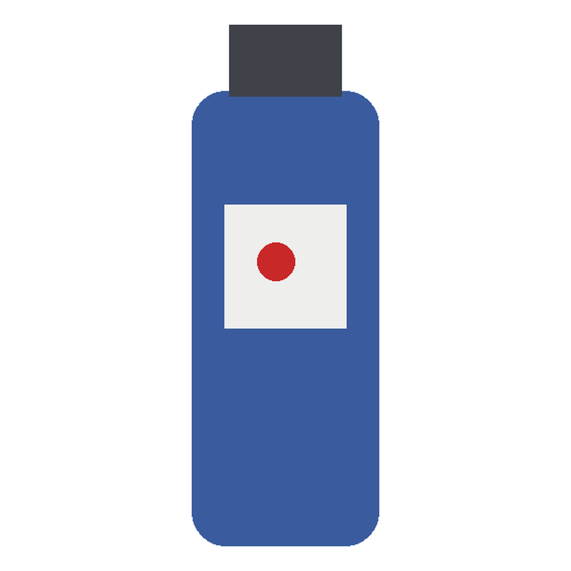
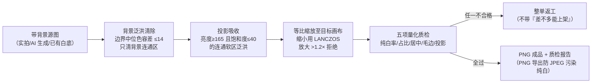

# 白底图生成 White Background Image Generate

> 原子技能 ｜ 属于「商品视觉师」 ｜ 电商小卖家客群 ｜ T2 提示词 + 质检脚本（交付真实文件）
>
> **把带背景的商品图变成平台能过审的纯白底主图，并用五个量化指标判定「能不能交」。**
> 四条硬标准全部量化 · 5 项脚本质检指标 · 3 条按来源分线的处理路径 · 8 类高频失败模式拦截
> 淘宝/天猫/拼多多白底强制类目的入场券——「看起来白了其实没白」是平台算法一测一个准的重灾区



🎬 **[▶ 观看演示视频](docs/assets/demo.mp4)** — 四幕创作叙事：业务钩子 → 真实执行 → 要点到成稿演变 → 交付物

*上图来自真实执行：`python scripts/white_bg.py --demo`，900×900 带米灰背景与投影的源图 → 800×800 纯白底主图，五项质检全部通过，成品 PNG + 报告落盘。*

---

## 它做什么（四条硬标准，全部量化）

| # | 硬标准 | 量化口径 | 为什么较真 |
|---|---|---|---|
| 1 | 背景纯白 | RGB(255,255,255)，纯白率 100% | JPEG 压缩后背景是 (254,254,252)，肉眼不可辨，平台算法判「非白底图」 |
| 2 | 商品占比 | 方形商品：外接矩形面积 ≥80%；非方形：外接矩形长边 / 画布短边 ≥90% | 连衣裙、花瓶类竖长商品按面积口径必然误报——这是本领域最常见的口径错误 |
| 3 | 居中 | 外接矩形中心偏差 ≤ 画布短边 2%（800px 即 ≤16px） | 平台类目审核项 |
| 4 | 边缘干净 | 过渡带平均厚度 ≤1.2px（>2.0px 是肉眼可见灰边）；不带投影与倒影 | 放大镜功能下毛边显形 |

**平台规格基线**（2026-09 整理，以上传页实时提示为准）：

| 平台 | 主图规格 | 白底要求 | 备注 |
|---|---|---|---|
| 淘宝/天猫 | 800×800 或 1000×1000 | 类目要求白底 | 短边 ≥800 才有放大镜；除品牌 Logo 外禁文字 |
| 拼多多 | 750×750 | **强制白底** | 首图白底为类目审核项 |
| 抖音商品卡 | 3:4（750×1000） | 不强制 | 主图文字 ≤20% |
| 小红书 | 3:4 / 1:1 | 不强制 | 首图禁牛皮癣 |

**处理方法按来源分三条路**：实拍带背景图走「四边向内背景泛洪」（容差 ≤14，绝不全图阈值抠图——否则白衬衫/白标签被一起抠掉）；AI 生成图先过保真校验再白底化；已有白底但不合格的只做补白 + 居中裁切，不二次抠图。

## 真实输入 → 真实输出

**输入**（`examples/input.json`）：蓝瓶精华液 50ml，900×900 实拍示意图（米灰背景 + 右下投影），目标淘宝主图 800×800。

**输出**（脚本实跑，`out/whitebg.json`，判定 ✅ 通过）：

| # | 指标 | 实测值 | 判定 | 口径 |
|---|---|---|---|---|
| 1 | 背景纯白率 | 100.0% | ✅ | 成品四边框像素全部为 RGB(255,255,255) |
| 2 | 商品占比 | 长边 91.5%（面积 30.4%） | ✅ | 非方形按长边/画布短边 ≥90% 判 |
| 3 | 居中偏差 | 0.00% | ✅ | ≤画布短边 2% |
| 4 | 毛边/过渡带 | 0.99px | ✅ | ≤1.2px，>2.0px 返工 |
| 5 | 投影/倒影残留 | 10595 px（已清除） | ✅ | 亮度≥165 且饱和度≤40 的贴边软区并入背景 |

成品图（脚本实跑产物）：`out/白底主图_800x800.png`



完整报告见 [`examples/output.md`](examples/output.md)；Excel 版：`out/白底化质检报告.xlsx`。

## 处理流水线



## 快速开始

**方式一：提示词（任意 AI 工具）**

```text
1. 打开 prompt.txt，全文复制
2. 粘贴到 Coze / WorkBuddy / Dify / Claude / ChatGPT
3. 按 schema.json 的输入规格提供：源图描述 + 目标画布 + 平台
```

**方式二：脚本（零 AI 依赖，确定性质检）**

```bash
# 演示模式（现场生成样例源图并跑通全流程）
python scripts/white_bg.py --demo
# 指定源图
python scripts/white_bg.py --src examples/assets/demo_src_colored.png --size 800x800 --outdir out
```

依赖：`pip install pillow openpyxl`（缺失时脚本会打印修复命令，不静默失败）。

## 该用 / 别用

| ✅ 该用 | ❌ 别用 |
|---|---|
| 淘宝/拼多多白底强制类目的上架主图制作 | 场景合成、卖点文案（交给 `scene-image-compose` / `copy-layout`） |
| AI 生成图上架前的白底化 + 质检（先过保真校验） | 白色/近白商品自动抠图（白瓷、珍珠白——必须人工描边） |
| 批量 SKU 上架前的白底归一（多平台适配走 `multi-platform-spec-flow`） | 玻璃/透明材质硬抠（须 Alpha matting 保留 30%–70% 透明度） |
| 「看起来白了」的最终判定（脚本实测，不肉眼估） | 在白底图上加文字、边框、促销贴片（淘宝主图禁牛皮癣） |

## 边界与合规

- 本资产输出为 **AI 辅助生成内容**，质检结论须经人工复核后方可上架
- 白底图是商品实物展示，**不得用 AI 改变商品本体**（颜色/材质/结构）——改动即触发《广告法》第 28 条虚假宣传风险
- 不构成平台审核保证；平台白底与尺寸规则持续更新，以上传页实时提示为准
- 成品必须 PNG 导出（或 JPEG q≥95 + 4:4:4），防止纯白被压缩污染

## 文件地图

```text
├── README.md                ← 本文件
├── SKILL.md                 ← 资产定义（元信息 / 契约 / 边界）
├── prompt.txt               ← 提示词本体（四条硬标准 + 三条处理路径 + 失败模式）
├── schema.json              ← 输入输出契约（机器可读）
├── scripts/white_bg.py      ← 白底化 + 五项质检脚本（泛洪抠图 → PNG/Excel/JSON）
├── examples/                ← 真实输入 + 脚本实跑输出
├── docs/                    ← 9 项配套文档（架构 / 流程 / 场景 / 测试报告…）
└── out/                     ← 实跑产物（白底主图_800x800.png / whitebg.json / 质检报告）
```

---

*本资产遵循 [bangwozuo 数字员工资产规范](https://github.com/bangwozuo/digital-employee-spec) v3.0 ｜ [所属员工：商品视觉师](../../) ｜ [总入口](https://github.com/bangwozuo/digital-employees-hub-zh)*
