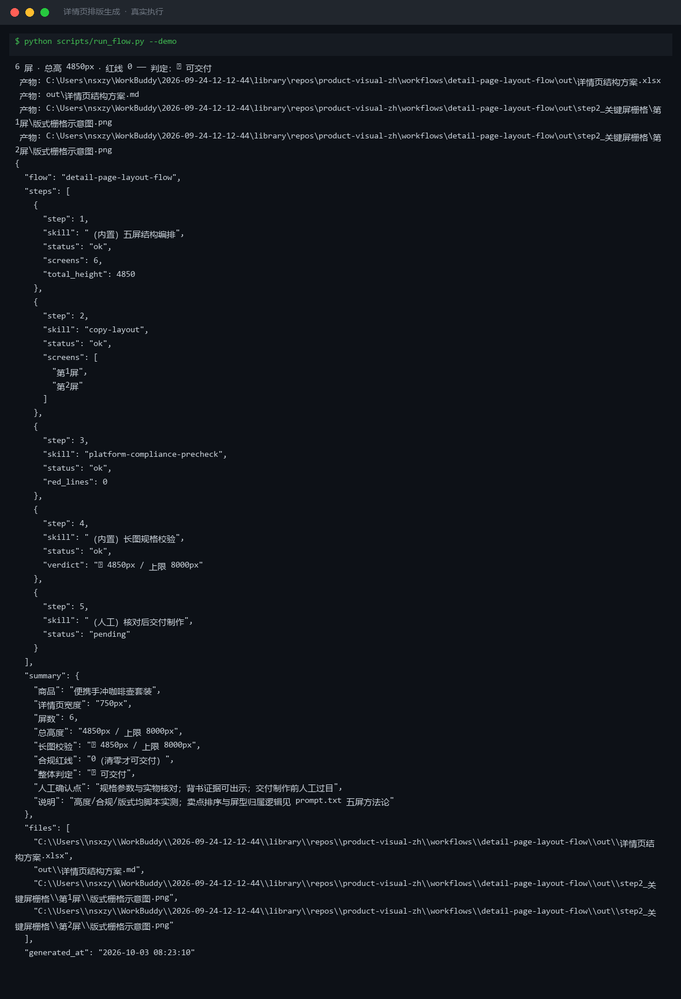
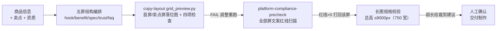
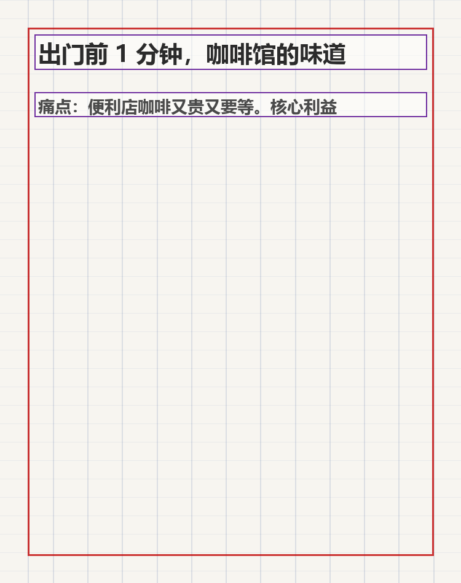
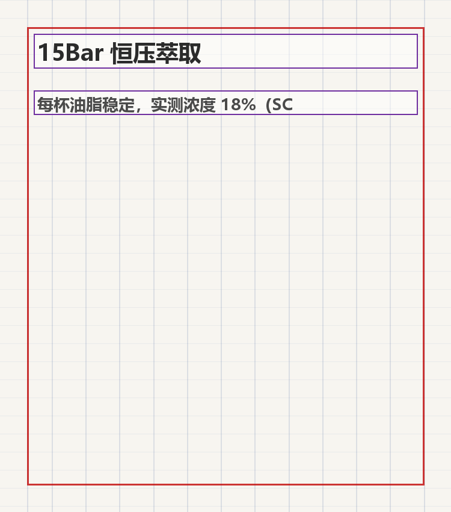

# 详情页排版生成 Detail Page Layout Flow

> 工作流（复合技能） ｜ 属于「商品视觉师」 ｜ 电商小卖家客群 ｜ T3 编排层（脚本 `run_flow.py`）
>
> **把卖点文案变成结构化、可制作、合规、不超长的详情页方案——一条「痛点→卖点→证据→答疑」的说服路径。**
> 编排 2 个原子技能（copy-layout 关键屏落位 / platform-compliance-precheck 全文扫描）
> 五屏说服路径结构（首屏钩子/卖点/规格/背书/FAQ） · 长图总高 ≤8000px 校验
> 首屏公式（≤9 字钩子 + ≤14 字核心利益 + 信任锚） · 全屏合规红线清零才交付



🎬 **[▶ 观看演示视频](docs/assets/demo.mp4)** — 四幕创作叙事：业务钩子 → 真实执行 → 要点到成稿演变 → 交付物

*上图来自真实执行：`python scripts/run_flow.py --demo`，便携手冲咖啡壶套装（750px 宽）——6 屏结构总高 4850px / 上限 8000px，合规红线 0，第 1/2 屏落位检查通过 → 判定 ✅ 可交付。*

---

## 它编排什么（流程 DAG）

| # | 步骤 | 执行者 | 输出 | 失败处理 |
|---|---|---|---|---|
| 1 | 五屏结构编排 | 内置/模型 | 逐屏内容表（屏型/文案/高度预算） | 卖点 >4 个按核心利益相关度取前 4；缺参数标「待补」，不编造 |
| 2 | 关键屏落位 | `copy-layout` | 首屏 + 第一个卖点屏落位图 + 检查 | 字号/对比度/面积 FAIL → 按整改指令调整重跑 |
| 3 | 全文合规扫描 | `platform-compliance-precheck` | 逐屏违规清单 | 任一屏红线 >0 → 该屏打回改文案，清零才进下一步 |
| 4 | 长图规格校验 | 内置 | 总高度 vs 8000px、屏数、超长预警 | 超长 → 输出裁剪建议（合并/删屏优先级） |
| 5 | 人工确认 | 人工 | 交付设计制作 | 规格参数屏数值须人工与实物核对后交付 |



### 详情页结构方法论（五屏说服路径）

| 屏 | 高度预算 | 核心规则 |
|---|---|---|
| 1 首屏钩子 | 750–1000px | 只回答「这商品和我有什么关系」；公式 = 痛点钩子 ≤9 字 + 核心利益 ≤14 字 + 信任锚；**禁止堆 5 个卖点** |
| 2 卖点屏（×2–3） | 750–950px/屏 | 每屏 1 个卖点（60% 买家只看前 3 屏）；参数必须可验证——写「6 小时保温 60 度以上（实验室实测）」，不写「超长保温」 |
| 3 规格参数屏 | 500–700px | 表格化，与包装一致；**与实物不符的参数比没有参数更危险** |
| 4 信任背书屏 | 500–700px | 只放可出示证据的项；编造资质是《广告法》第 28 条红线 |
| 5 FAQ 屏 | 500–900px | 客服高频问题 TOP 5，把「客服没空回」的问题提前答掉 |

## 真实输入 → 真实输出

**输入**（`examples/input.json`）：便携手冲咖啡壶套装，宽 750px，6 屏内容（hook「出门前 1 分钟，咖啡馆的味道」950px / benefit「15Bar 恒压萃取」850px / … / faq 900px）。

**输出**（脚本实跑，判定 **✅ 可交付**，节选）：

| # | 屏型 | 标题 | 高度px | 合规 |
|---|---|---|---|---|
| 1 | 首屏钩子 | 出门前 1 分钟，咖啡馆的味道 | 950 | ✅ 0 红线 |
| 2 | 卖点 | 15Bar 恒压萃取 | 850 | ✅ 0 红线 |
| 3 | 卖点 | 304 不锈钢随身杯 | 850 | ✅ 0 红线 |
| 4 | 规格参数 | 规格参数 | 650 | ✅ 0 红线 |
| 5 | 信任背书 | 信任背书 | 650 | ✅ 0 红线 |
| 6 | FAQ | 常见问题 | 900 | ✅ 0 红线 |

长图校验：总高 4850px / 上限 8000px ✅；关键屏落位：第 1 屏通过（文字面积 8.7%）、第 2 屏通过（9.7%）。

关键屏落位图（脚本实跑产物）：

|  |  |
|---|---|
| 第 1 屏（首屏钩子） | 第 2 屏（核心卖点） |

完整报告见 [`examples/output.md`](examples/output.md)；Excel 版：`out/详情页结构方案.xlsx`。

## 快速开始

**方式一：提示词（任意 AI 工具）**

```text
1. 打开 prompt.txt，全文复制
2. 粘贴到 Coze / WorkBuddy / Dify / Claude / ChatGPT
3. 按 schema.json 输入规格提供：商品 + 宽度 + 逐屏内容（type/title/text/height）
```

**方式二：脚本（零 AI 依赖，全链路实测）**

```bash
# 演示模式（内置真实样例）
python scripts/run_flow.py --demo
# 指定输入
python scripts/run_flow.py --input examples/input.json --outdir out
```

依赖：`pip install pillow openpyxl`。

## 该用 / 别用

| ✅ 该用 | ❌ 别用 |
|---|---|
| 新品详情页从卖点清单到可制作方案 | 长图总高超 8000px 还给「可交付」结论（平台压缩变糊 + 加载流失） |
| 每屏只讲一件事（一屏双卖点=两个都没讲清） | 一屏塞 2 个以上核心卖点 |
| 超长先做减法（合并卖点→删弱卖点→压缩 FAQ） | 把字缩小硬塞（缩略图上全是蚂蚁线） |
| 参数缺就标「待补」、资质只放可出示的 | 编造参数与资质（缺的填默认值=虚假宣传） |
| 首屏用场景钩子抓人 | 首屏用「最/第一/100%」极限词抓眼球（转化没换来先换来处罚） |

## 边界与合规

- 本工作流输出为 **AI 辅助生成内容**，交付制作前人工确认
- 全部屏文案过 `platform-compliance-precheck`，红线清零才交付
- 参数与资质表述以实物与真实证书为准，本流程不做事实核验
- 平台对详情页的规则（尺寸/上限/资质）以官方最新公示为准

## 文件地图

```text
├── README.md                ← 本文件
├── SKILL.md                 ← 资产定义（元信息 / 契约 / 边界）
├── prompt.txt               ← 编排提示词本体（五屏方法论 + 验收口径 + DAG）
├── schema.json              ← 输入输出契约（机器可读）
├── scripts/run_flow.py      ← 五步编排脚本（结构→落位→合规→长图校验→方案）
├── examples/                ← 真实输入 + 脚本实跑输出
├── docs/                    ← 9 项配套文档（架构 / 流程 / 场景 / 测试报告…）
└── out/                     ← 实跑产物（step2 关键屏栅格 / 详情页结构方案.xlsx）
```

---

*本资产遵循 [bangwozuo 数字员工资产规范](https://github.com/bangwozuo/digital-employee-spec) v3.0 ｜ [所属员工：商品视觉师](../../) ｜ [总入口](https://github.com/bangwozuo/digital-employees-hub-zh)*
