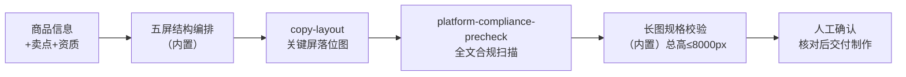

# 详情页排版生成

把卖点文案变成**结构化、可制作、合规、不超长**的详情页方案。手机买家在详情页
停留以秒计——详情页不是信息堆场，是一条「痛点→卖点→证据→答疑」的说服路径。

## 元信息

| 字段 | 值 |
|------|-----|
| ID | `de_ecom_01_wf05` |
| 类型 | **`composite`（复合技能/工作流）** |
| 所属员工 | 商品视觉师 |
| 阶段 | `P1` |
| 复杂度 | `M` |
| 触发方式 | 人工 |
| ROI | 替代外包 ¥1500/套 |
| 资产形态 | 可跑编排脚本 + 深度流程提示词（无模型调用依赖、无 API Key） |

## 编排的原子技能

| # | 原子技能 | 能力 |
|---|---------|------|
| 1 | [文案排版](../../skills/copy-layout/) | 版式栅格落位 + 量化检查（scripts/grid_preview.py） |
| 2 | [平台合规预审](../../skills/platform-compliance-precheck/) | 全部屏文案极限词扫描（scripts/precheck.py） |

## 步骤链路（DAG）



## 步骤明细

| # | 步骤 | 技能资产 | 输入 | 输出 | 失败处理 |
|---|------|---------|------|------|---------|
| 1 | 五屏结构编排 | （内置/模型） | 商品+卖点+参数+资质 | 逐屏内容表（屏型/文案/高度预算） | 卖点 >4 个按决策影响度取前 4；缺参数标「待补」，不编造 |
| 2 | 关键屏落位 | `copy-layout` | 首屏+第一卖点屏文字块 | `out/step2_关键屏栅格/第N屏/` | 退出码≠0 中止；版式 FAIL → 整体判「不可交付」 |
| 3 | 全文合规扫描 | `platform-compliance-precheck` | 全部屏文案 | `out/step3_合规扫描/` + 逐屏红线归属 | 红线屏标「打回改文案」，清零才可交付 |
| 4 | 长图规格校验 | （内置） | 逐屏高度预算 | 总高 vs 8000px、屏数、超长裁剪建议 | 总高 >8000px 输出裁剪建议（合并/删屏/压 FAQ）；屏高非法中止 |
| 5 | 人工确认 | （人工） | 结构表+落位图+合规清单 | 交付设计制作 | 规格参数须与实物核对；背书证据须可出示 |

## 五屏说服路径（方法论要点）

| 屏 | 高度建议 | 要点 |
|---|---|---|
| 首屏钩子 | 750–1000px | 痛点 ≤9 字 + 核心利益 ≤14 字 + 信任锚；只回答"和我有什么关系" |
| 卖点屏 ×N | 750–950px | **每屏 1 个卖点** + 一个佐证（实测数据/认证编号）；前 3 屏放完核心卖点 |
| 规格参数 | 500–700px | 与包装一致；参数不实比没有更危险（虚假宣传） |
| 信任背书 | 500–700px | 只放可出示证据的项（报告编号/质保） |
| FAQ | 500–900px | 客服高频问题 TOP 5，把"买前疑虑"提前答掉 |

## 输入规格

| 字段 | 类型 | 必填 | 说明 |
|------|------|------|------|
| `product` | string | ✅ | 商品名 |
| `width` | number | ⬜ | 详情页宽度，默认 750 |
| `screens` | array | ✅ | 逐屏：type（hook/benefit/spec/trust/faq）/ title / text / height（高度预算 px） |

## 输出规格

| 字段 | 类型 | 说明 |
|------|------|------|
| `summary` | object | 屏数、总高度、红线数、长图校验、整体判定 |
| `steps` | array | 各步骤状态与产物路径 |
| `deliverable` | file | `out/详情页结构方案.xlsx`（结构表/逐屏合规/关键屏版式/违规命中/汇总）+ md 报告 |

## 错误处理

| 情况 | 处理方式 |
|------|---------|
| screens 为空 / 屏型非法 / 屏高 ≤0 | 中止（输入缺失或非法） |
| 上游脚本退出码≠0 | 中止并打印 stderr |
| 合规红线 >0 | 红线屏标「打回改文案」，整体判「不可交付」 |
| 关键屏版式 FAIL | 整体判「不可交付」，按整改指令调整 |
| 总高 >8000px | 输出「超长 + 裁剪建议」，不判可交付 |

## 使用步骤

### 方式一：跑脚本（端到端）

```bash
python3 <FLOW_DIR>/scripts/run_flow.py --input input.json --outdir out
python3 <FLOW_DIR>/scripts/run_flow.py --demo
```

### 方式二：手动编排（任意 AI 平台）

1. 按 prompt.txt 五屏方法论给卖点排序、定屏型与高度预算
2. 用 copy-layout prompt 出首屏与卖点屏落位；用 platform-compliance-precheck 扫全文
3. 汇总总高 ≤8000px、红线清零后交人工核对参数与证据

## 验收标准

- [x] DAG 节点为本仓真实技能 slug（copy-layout / platform-compliance-precheck）
- [x] 逐屏高度、总高上限、合规红线、版式检查全部脚本实测
- [x] 超长/红线/版式三条不可交付路径均可触发
- [x] 规格参数人工核对环节不可跳过

## 边界（不做的事）

- ❌ 总高超 8000px 不判可交付；超长先做减法而非缩小字号
- ❌ 参数与资质不编造，缺参数标「待补」
- ❌ 一屏不塞 2 个以上核心卖点；首屏不用极限词抓眼球
- ❌ 文案红线未清零不进长图校验结论
- ❌ 不做事实核验——参数真伪由人工对照实物

## 调用示例

**输入**（`examples/input.json`）：便携手冲咖啡壶套装，750 宽，6 屏（首屏钩子 950px +
卖点×2 + 规格 + 背书 + FAQ），逐屏高度预算齐。

**输出**（run_flow.py 实跑，退出码 0）：6 屏 · 总高 4850px / 上限 8000px · 红线 0 ·
首屏与卖点屏版式「通过」（文字面积 8.7%/9.7%）→ 判定**可交付**。
产物 `out/详情页结构方案.xlsx` + md + 两屏落位图。详见 `examples/output.md`。

## 所属工作流

本资产为复合技能（工作流），为新品上架链路的详情页环节；版式与合规能力分别由
`copy-layout`、`platform-compliance-precheck` 提供。

## 合规声明

- 本流程输出为 **AI 辅助结构方案**，交付制作前必须人工确认，输出标注 AI 生成内容
- 全部屏文案以 `platform-compliance-precheck` 扫描结果为预审口径，不构成法律意见
- 参数与资质表述以实物与真实证书为准；平台详情页规则以官方最新公示为准

---

*本技能遵循 [bangwozuo 数字员工资产规范](https://github.com/bangwozuo/digital-employee-spec) v3.0*
