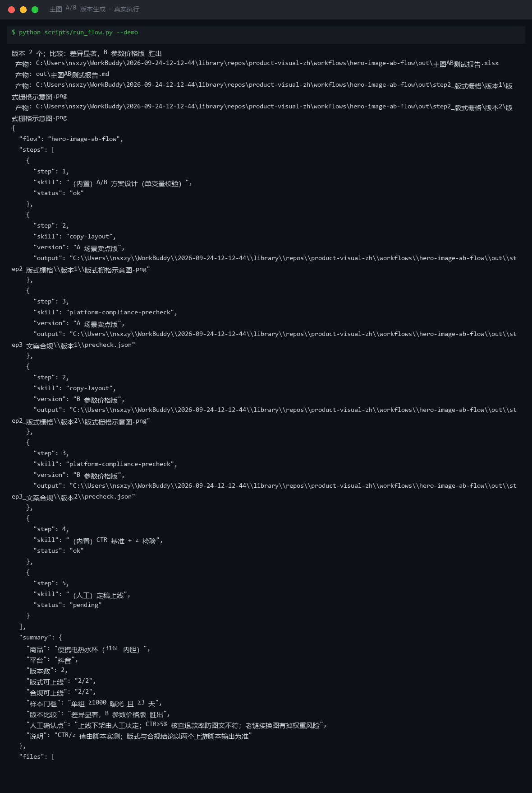
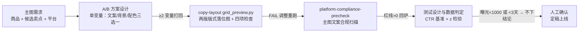
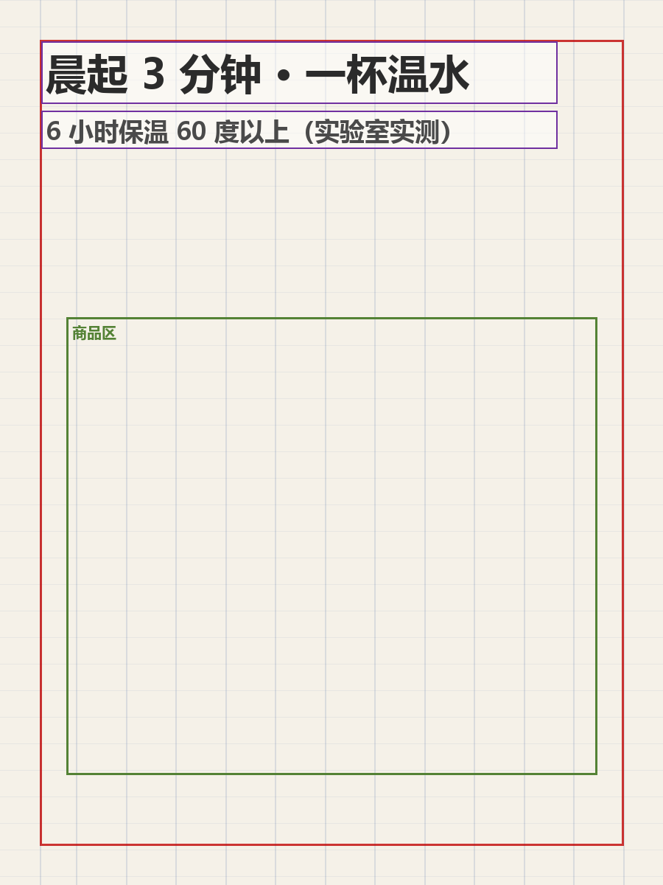
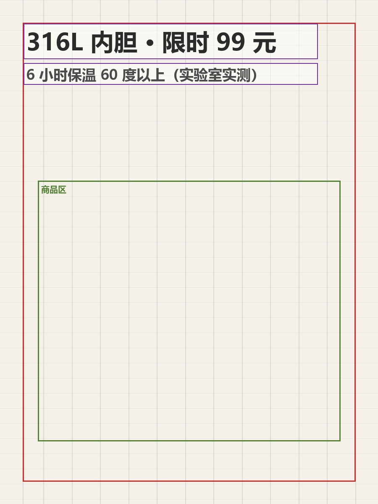

# 主图 A/B 版本生成 Hero Image A/B Flow

> 工作流（复合技能） ｜ 属于「商品视觉师」 ｜ 电商小卖家客群 ｜ T3 编排层（脚本 `run_flow.py`）
>
> **产出可上线测试的主图 A/B 方案，并把测试数据换成统计上站得住的结论——样本不够就是不够。**
> 编排 2 个原子技能（copy-layout 版式落位 / platform-compliance-precheck 合规扫描）
> 样本门槛（单组曝光 ≥1000 且 ≥3 天） · 两比例 z 检验（|z| ≥1.96 才算显著）
> 单变量原则（一次只变文案/背景/配色其一） · CTR 基准四档判定




🎬 **[▶ 观看高清完整版（mp4）](https://cdn.jsdelivr.net/gh/bangwozuo/product-visual-zh@main/workflows/hero-image-ab-flow/docs/assets/demo.mp4)** — 四幕创作叙事：业务钩子 → 真实执行 → 要点到成稿演变 → 交付物

*上图来自真实执行：`python scripts/run_flow.py --demo`，便携电热水杯抖音主图 A/B——A 场景卖点版 CTR 3.00% vs B 参数价格版 4.23%，z=2.61（p=0.0091），判定 B 显著胜出（+41.0%）。*

---

## 它编排什么（流程 DAG）

| # | 步骤 | 执行者 | 输出 | 失败处理 |
|---|---|---|---|---|
| 1 | A/B 方案设计 | 内置 | 两版差异说明（**单变量**） | 差异 ≥2 个变量 → 打回（赢了也无法归因） |
| 2 | 版式落位 | `copy-layout` | 两版版式落位图 + 检查结果 | 检查 FAIL → 按整改指令调整重跑，仍 FAIL 不得上线 |
| 3 | 文案合规扫描 | `platform-compliance-precheck` | 逐版本违规清单 | 红线 >0 的版本回步骤 1 改文案 |
| 4 | 测试设计与判定 | 内置（z 检验） | CTR、基准判定、显著性结论 | 单组曝光 <1000 或 <3 天 → 「样本不足，不下结论」 |
| 5 | 人工确认 | 人工 | 定稿上线 / 回炉 | 老链接换主图掉权重风险，人工决策 |



### A/B 测试判定规则（全部量化）

**样本门槛**：单组曝光 ≥1000 且测试 ≥3 天才允许比较——低于门槛的 CTR 波动主要是噪声（时段/流量结构一天内能差 30%+）。跨整周测，大促期间不测。

**CTR 基准**：

| CTR | 判定 | 动作 |
|---|---|---|
| < 1% | 主图有问题 | 与类目标杆逐项对比，回步骤 1 重设计 |
| 1% – 2% | 偏弱 | 换主卖点或加价格锚点再测 |
| 2% – 5% | 电商正常区间 | 按 z 检验比较版本 |
| > 5% | 优秀但要防假 | 核查标题党/图文不符——高 CTR 高退款 = 过度承诺 |

**版本比较**（两比例 z 检验，脚本计算）：|z| ≥ 1.96（p<0.05）→ 差异显著，选 CTR 高的版本并报告相对提升；|z| < 1.96 → **不下结论**，禁止凭「看着高一点」切版本；显著但提升 <10% → 权衡老链接换图掉权重风险，人工决策。

## 真实输入 → 真实输出

**输入**（`examples/input.json`）：便携电热水杯（316L 内胆），抖音，A「场景卖点版」与 B「参数价格版」各含版式配置与测试数据（4 天 / 3200 曝光 / 96 点击 vs 4 天 / 3050 / 129）。

**输出**（脚本实跑，节选）：

| 版本 | 天数 | 曝光 | 点击 | CTR | 基准判定 |
|---|---|---|---|---|---|
| A 场景卖点版 | 4 | 3200 | 96 | 3.00% | ✅ 电商正常区间（2–5%） |
| B 参数价格版 | 4 | 3050 | 129 | 4.23% | ✅ 电商正常区间（2–5%） |

统计判定：z = 2.61（阈值 ±1.96）、p = 0.0091、相对提升 +41.0% → **差异显著，B 参数价格版胜出**。

版式与合规留痕：两版版式判定均通过（文字面积 8.8%）、合规红线 0 → 均可上线。

两版版式落位图（脚本实跑产物）：

|  |  |
|---|---|
| A 场景卖点版 | B 参数价格版 |

完整报告见 [`examples/output.md`](examples/output.md)；Excel 版：`out/主图AB测试报告.xlsx`。

## 快速开始

**方式一：提示词（任意 AI 工具）**

```text
1. 打开 prompt.txt，全文复制
2. 粘贴到 Coze / WorkBuddy / Dify / Claude / ChatGPT
3. 按 schema.json 输入规格提供：商品 + 平台 + 2–4 版（文案/版式配置），
   测试数据（days/impressions/clicks）测后回填
```

**方式二：脚本（零 AI 依赖，全链路实测）**

```bash
# 演示模式（内置真实样例）
python scripts/run_flow.py --demo
# 指定输入
python scripts/run_flow.py --input examples/input.json --outdir out
```

依赖：`pip install pillow openpyxl`。

## 该用 / 别用

| ✅ 该用 | ❌ 别用 |
|---|---|
| 两版主图谁更好的量化裁决（z 检验说话） | 曝光 <1000 或 <3 天就宣布获胜（那是噪声） |
| 单变量对照实验（文案/背景/配色三选一） | 两变量以上的「伪 A/B」（赢了不知道归功谁） |
| 主图上线前的合规 + 版式双预检 | 用「感觉 A 更好看」替代统计判定 |
| CTR 高但转化低时先查详情页承接 | 承诺「换这张图 CTR 必到 x%」——结论只基于已发生数据 |

## 边界与合规

- 本工作流输出为 **AI 辅助生成内容**，上线下架由人工决定
- 主图 AI 生成内容按平台规则标注；不得为拉 CTR 做图文不符的过度承诺
- CTR >5% 时核查退款率防过度承诺；测试数据属店铺经营数据，不外传
- 极限词版本一律打回（「全网最低价/第一/100%」类必拦）

## 文件地图

```text
├── README.md                ← 本文件
├── SKILL.md                 ← 资产定义（元信息 / 契约 / 边界）
├── prompt.txt               ← 编排提示词本体（DAG + A/B 方法论 + 判定规则）
├── schema.json              ← 输入输出契约（机器可读）
├── scripts/run_flow.py      ← 五步编排脚本（设计→落位→合规→z 检验→报告）
├── examples/                ← 真实输入 + 脚本实跑输出
├── docs/                    ← 9 项配套文档（架构 / 流程 / 场景 / 测试报告…）
└── out/                     ← 实跑产物（step2 版式栅格 / step3 文案合规 / 主图AB测试报告）
```

---

*本资产遵循 [bangwozuo 数字员工资产规范](https://github.com/bangwozuo/digital-employee-spec) v3.0 ｜ [所属员工：商品视觉师](../../) ｜ [总入口](https://github.com/bangwozuo/digital-employees-hub-zh)*
