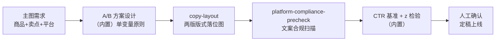

# 主图 A/B 版本生成

产出**可上线测试的主图 A/B 方案**并把测试数据换成**统计上站得住的结论**：
哪版赢、赢多少、是不是运气。样本不够就是不够——曝光 <1000 或测试 <3 天不下结论。

## 元信息

| 字段 | 值 |
|------|-----|
| ID | `de_ecom_01_wf02` |
| 类型 | **`composite`（复合技能/工作流）** |
| 所属员工 | 商品视觉师 |
| 阶段 | `P0` |
| 复杂度 | `S` |
| 触发方式 | 人工 |
| ROI | 替代外包 ¥300/张 |
| 资产形态 | 可跑编排脚本 + 深度流程提示词（无模型调用依赖、无 API Key） |

## 编排的原子技能

| # | 原子技能 | 能力 |
|---|---------|------|
| 1 | [文案排版](../../skills/copy-layout/) | 版式栅格落位 + 字号/对比度/面积检查（scripts/grid_preview.py） |
| 2 | [平台合规预审](../../skills/platform-compliance-precheck/) | 主图文案极限词扫描（scripts/precheck.py） |

## 步骤链路（DAG）



## 步骤明细

| # | 步骤 | 技能资产 | 输入 | 输出 | 失败处理 |
|---|------|---------|------|------|---------|
| 1 | 方案设计 | （内置） | 商品+候选卖点 | 两版单变量差异说明 | 差异 ≥2 变量打回重设计；卖点 <2 个先做卖点梳理 |
| 2 | 版式落位 | `copy-layout` | 每版文字块配置 | `out/step2_版式栅格/版本N/` 落位图+检查 | 退出码≠0 中止；检查 FAIL 按整改指令重跑，FAIL 版不得上线 |
| 3 | 文案合规 | `platform-compliance-precheck` | 每版主图文案 | `out/step3_文案合规/版本N/precheck.json` | 红线 >0 打回改文案（"最低价/第一/100%"必拦） |
| 4 | 数据判定 | （内置） | days/impressions/clicks | CTR、基准判定、z 检验 | 曝光 <1000 或天数 <3 →「样本不足，不下结论」；缺数据标「数据缺失」 |
| 5 | 人工确认 | （人工） | 全部留痕 | 定稿上线 | 老链接换图掉权重风险人工权衡；CTR>5% 核查退款率 |

## 判定口径（量化）

| 项 | 规则 |
|---|---|
| 样本门槛 | 单组曝光 ≥1000 且测试 ≥3 天（跨整周，避开大促） |
| CTR 基准 | <1% 主图有问题；1–2% 偏弱；2–5% 正常区间；>5% 优秀但防图文不符 |
| 版本比较 | 两比例 z 检验，\|z\| ≥ 1.96（p<0.05）才判显著；<10% 提升提示换图风险 |
| 单变量 | 主文案 / 背景 / 配色一次只变一个 |

## 输入规格

| 字段 | 类型 | 必填 | 说明 |
|------|------|------|------|
| `product` | string | ✅ | 商品名 |
| `platform` | string | ✅ | 投放平台（决定版式与文字面积规则） |
| `versions` | array | ✅ | 2–4 版：name / text（主图文案）/ layout（文字块配置）/ days·impressions·clicks（测试后回填） |

## 输出规格

| 字段 | 类型 | 说明 |
|------|------|------|
| `summary` | object | 版本数、版式/合规可上线数、样本门槛、比较结论 |
| `steps` | array | 各步骤状态与产物路径 |
| `deliverable` | file | `out/主图AB测试报告.xlsx`（版本判定/版式留痕/合规留痕/统计判定）+ md 报告 |

## 错误处理

| 情况 | 处理方式 |
|------|---------|
| 版本数 <2 | 中止（A/B 至少两版） |
| 上游脚本退出码≠0 | 中止并打印 stderr |
| 版式检查 FAIL | 该版本标「不可上线」，不阻塞其他版本 |
| 文案红线 >0 | 该版本打回改文案 |
| 曝光/天数不足或缺数据 | 「样本不足，不下结论」/「数据缺失」，正常退出 |

## 使用步骤

### 方式一：跑脚本（端到端）

```bash
python3 <FLOW_DIR>/scripts/run_flow.py --input input.json --outdir out   # 测试数据回填后
python3 <FLOW_DIR>/scripts/run_flow.py --demo
```

### 方式二：手动编排（任意 AI 平台）

1. 按单变量原则写两版差异说明与文案
2. 用 copy-layout prompt 出两版落位；用 platform-compliance-precheck 扫两版文案
3. 上线测试 ≥3 天、单组 ≥1000 曝光后，按 z 检验口径比较（脚本或手动代入公式）

## 验收标准

- [x] DAG 节点为本仓真实技能 slug（copy-layout / platform-compliance-precheck）
- [x] 单变量设计、样本门槛、z 检验全部量化且脚本可复算
- [x] 样本不足路径可演练（不下结论而非编结论）
- [x] 上线动作保留人工确认

## 边界（不做的事）

- ❌ 不在样本不足时宣布胜负；不用"感觉"替代 z 检验
- ❌ 极限词文案版本不得上线
- ❌ 不设计两变量以上"伪 A/B"；不编造测试数据
- ❌ 不承诺换图后的 CTR 数值；结论只基于已发生数据

## 调用示例

**输入**（`examples/input.json`）：便携电热水杯，抖音商品卡，A「场景卖点版」vs B「参数价格版」
（仅主文案不同），各 4 天、约 3100 曝光。

**输出**（run_flow.py 实跑，退出码 0）：A CTR 3.00% / B 4.23%，z=2.61（p=0.0091），
相对提升 +41.0% → **差异显著，B 胜出**；两版版式通过（文字面积 8.8%）、合规 0 红线。
产物 `out/主图AB测试报告.xlsx` + md + 两版落位图。详见 `examples/output.md`。

## 所属工作流

本资产为复合技能（工作流），为主图优化独立流程；版式与合规能力分别由
`copy-layout`、`platform-compliance-precheck` 提供。

## 合规声明

- 本流程输出为 **AI 辅助测试结论**，上线下架由人工决定，输出标注 AI 生成内容
- 主图 AI 生成内容按平台规则标注；不得为 CTR 做图文不符的过度承诺
- 测试数据属店铺经营数据，不外传

---

*本技能遵循 [bangwozuo 数字员工资产规范](https://github.com/bangwozuo/digital-employee-spec) v3.0*
