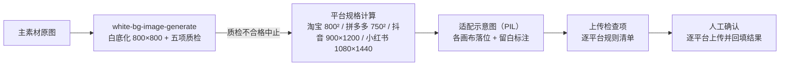
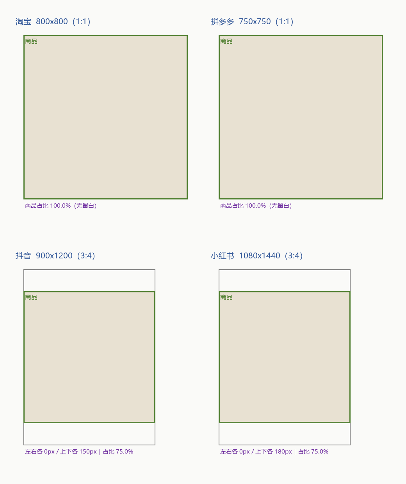

# 多平台规格一键适配 Multi Platform Spec Flow

> 工作流（复合技能） ｜ 属于「商品视觉师」 ｜ 电商小卖家客群 ｜ T3 编排层（脚本 `run_flow.py`）
>
> **把一套主素材变成各平台可直接上传的规格包——缩放比、留白、占比全部脚本算出来，不「随手缩放」。**
> 编排 `white-bg-image-generate`（白底归一 800×800 + 五项质检）
> 4 平台规格基线（淘宝/拼多多/抖音/小红书） · contain 留白 / cover 裁切自动选型
> 商品本体零裁切 · 商品占比 <50% 判不合格方案


🎬 **[▶ 观看演示视频（在线播放）](https://cdn.jsdelivr.net/gh/bangwozuo/product-visual-zh@main/workflows/multi-platform-spec-flow/docs/assets/demo.mp4) · [GitHub 页](https://github.com/bangwozuo/product-visual-zh/blob/main/workflows/multi-platform-spec-flow/docs/assets/demo.mp4)** — 四幕检测叙事：业务钩子 → 真实执行 → 检查项逐条亮灯 → 交付物

*上图来自真实执行：`python scripts/run_flow.py --demo`，便携电热水杯——白底归一质检通过后，一键产出淘宝/拼多多/抖音/小红书四平台规格表（缩放比 1.000/0.938/1.125/1.350）+ 适配示意图 + 逐平台上传检查项。*

---

## 它编排什么（流程 DAG）

| # | 步骤 | 执行者 | 输出 | 失败处理 |
|---|---|---|---|---|
| 1 | 白底归一 | `white-bg-image-generate` | 白底主图 800×800 + 五项质检 | 质检不合格 → 中止；源图长边 <800px → 先人工确认放大方案 |
| 2 | 平台规格计算 | 内置 | 逐平台画布/适配模式/缩放比/占比/留白 | 平台不在基线表 → 标「自定平台，需人工给规格」，不猜 |
| 3 | 适配示意图 | 内置 PIL | 各画布比例 + 商品落位 + 留白标注 | 绘图失败不阻塞规格表交付，标「示意图缺失」 |
| 4 | 上传检查项 | 内置 | 逐平台检查清单 | 注明「以上传页实时提示为准」 |
| 5 | 人工确认 | 人工 | 逐平台上传 | 上传被驳回 → 记录原因，回步骤 2 调整该平台方案 |



### 适配模式怎么算（核心逻辑）

1. **1:1 平台（淘宝 800/1000、拼多多 750）**：白底主图本身 1:1 → contain 等比缩放，商品居中无留白。缩放比 = 目标边 ÷ 800（0.938 / 1.0 / 1.25）
2. **3:4 平台（抖音 900×1200、小红书 1080×1440）**：contain 适配宽度撑满、上下留白——抖音：800×800 → 缩放 1.125 → 商品 900×900，占画布 75%，上下各留 150px 文字带（文字合计 ≤20%）
3. **cover 裁切仅用于场景图**：1:1 场景图裁 3:4 左右各裁 12.5%——主体居中才允许；**商品本体禁止任何裁切**
4. 商品占比红线：主图占比 <50% 列为不合格方案（缩略图里商品过小）

## 真实输入 → 真实输出

**输入**（`examples/input.json`）：

```json
{
  "product": "便携电热水杯（316L 内胆）",
  "platforms": ["淘宝", "拼多多", "抖音", "小红书"]
}
```

**输出**（脚本实跑，四平台全 ✅，节选）：

| 平台 | 画布 | 适配模式 | 缩放比 | 商品占比 | 留白区 | 状态 |
|---|---|---|---|---|---|---|
| 淘宝 | 800×800（1:1） | contain 直出 | 1.000 | 100.0% | 无 | ✅ |
| 拼多多 | 750×750（1:1） | contain 直出 | 0.938 | 100.0% | 无 | ✅ |
| 抖音 | 900×1200（3:4） | contain 等比留白 | 1.125 | 75.0% | 上下各 150px | ✅ |
| 小红书 | 1080×1440（3:4） | contain 等比留白 | 1.350 | 75.0% | 上下各 180px | ✅ |

上传检查项节选：淘宝 ≥800px 支持放大镜、除品牌 Logo 外禁文字/边框；拼多多白底、占比 ≥80% 更易过审；抖音主图文字 ≤20%；小红书贴边内容被圆角裁切（安全边距 8%）。

适配示意图与白底归一成品（脚本实跑产物）：

|  |  |
|---|---|
| 四平台画布落位与留白标注 | step1 白底归一成品 |

完整报告见 [`examples/output.md`](examples/output.md)；Excel 版：`out/平台适配规格表.xlsx`。

## 快速开始

**方式一：提示词（任意 AI 工具）**

```text
1. 打开 prompt.txt，全文复制
2. 粘贴到 Coze / WorkBuddy / Dify / Claude / ChatGPT
3. 按 schema.json 输入规格提供：商品名 + 主素材原图 + 目标平台列表
```

**方式二：脚本（零 AI 依赖，全链路实测）**

```bash
# 演示模式（自动生成样例图并跑通五步）
python scripts/run_flow.py --demo
# 指定输入
python scripts/run_flow.py --input examples/input.json --outdir out
```

依赖：`pip install pillow openpyxl`。

## 该用 / 别用

| ✅ 该用 | ❌ 别用 |
|---|---|
| 新品上架一次产出四平台上传包 | 非等比拉伸（把 1:1 拉成 3:4）——商品变形，保真必不合格 |
| 从同一张 800×800 白底图出发适配（比例不失真） | 多源头各自缩放（比例必然失真） |
| 3:4 平台上下留白带放利益点文字（≤20%） | 裁切商品本体（含 Logo、瓶盖、边缘高光） |
| 平台不在基线表时要求人工提供规格 | 编造平台规格；淘宝主图方案里加 Logo 之外文字 |

## 边界与合规

- 本工作流输出为 **AI 辅助生成内容**，逐平台上传动作由人工执行
- 平台规格以官方上传页实时提示为准（基线表为 2026-09 整理），冲突时人工确认
- 质检不合格的白底图不进入适配环节
- 上传被驳回的记录回写规格表，形成可回溯留痕

## 文件地图

```text
├── README.md                ← 本文件
├── SKILL.md                 ← 资产定义（元信息 / 契约 / 边界）
├── prompt.txt               ← 编排提示词本体（平台基线表 + 适配逻辑 + DAG）
├── schema.json              ← 输入输出契约（机器可读）
├── scripts/run_flow.py      ← 五步编排脚本（归一→规格计算→示意图→检查项→报告）
├── examples/                ← 真实输入 + 脚本实跑输出
├── docs/                    ← 9 项配套文档（架构 / 流程 / 场景 / 测试报告…）
└── out/                     ← 实跑产物（step1 白底归一 / 适配示意图.png / 规格表.xlsx）
```

---

*本资产遵循 [bangwozuo 数字员工资产规范](https://github.com/bangwozuo/digital-employee-spec) v3.0 ｜ [所属员工：商品视觉师](../../) ｜ [总入口](https://github.com/bangwozuo/digital-employees-hub-zh)*
