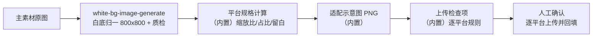

# 多平台规格一键适配

一套主素材 → 各平台可直接上传的规格包：**白底归一 → 逐平台算规格 → 示意图 +
检查项 → 人工上传确认**。每个平台的画布、比例、文字规则都不同，规格由脚本计算，
不口算、不猜。

## 元信息

| 字段 | 值 |
|------|-----|
| ID | `de_ecom_01_wf04` |
| 类型 | **`composite`（复合技能/工作流）** |
| 所属员工 | 商品视觉师 |
| 阶段 | `P1` |
| 复杂度 | `M` |
| 触发方式 | 事件（新品上架 / 新素材完成） |
| ROI | 月省 6h≈¥180 |
| 资产形态 | 可跑编排脚本 + 深度流程提示词（无模型调用依赖、无 API Key） |

## 编排的原子技能

| # | 原子技能 | 能力 |
|---|---------|------|
| 1 | [白底图生成](../../skills/white-bg-image-generate/) | 白底化 800×800 + 五项质检（scripts/white_bg.py） |

## 步骤链路（DAG）



## 步骤明细

| # | 步骤 | 技能资产 | 输入 | 输出 | 失败处理 |
|---|------|---------|------|------|---------|
| 1 | 白底归一 | `white-bg-image-generate` | 主素材原图 | `out/step1_白底归一/白底主图_800x800.png` + 质检 | 退出码≠0/产物缺失中止；质检不合格中止并给出报告路径 |
| 2 | 规格计算 | （内置） | 白底主图尺寸 + 平台清单 | 逐平台缩放比/占比/留白区（规格表） | 平台不在基线表 → 标「需人工给规格」，不阻塞其他平台 |
| 3 | 适配示意图 | （内置 PIL） | 规格计算结果 | `out/各平台画布适配示意图.png` | 绘制失败不阻塞，标「示意图缺失」 |
| 4 | 上传检查项 | （内置） | 平台基线表 | 逐平台检查清单（尺寸/比例/文字规则） | 规则更新滞后注明「以上传页实时提示为准」 |
| 5 | 人工上传确认 | （人工） | 规格包 | 逐平台上传结果回填 | 上传被驳回记录原因，回步骤 2 调整该平台 |

## 平台规格基线

| 平台 | 画布 | 比例 | 关键规则 |
|---|---|---|---|
| 淘宝/天猫 | 800×800（或 1000×1000） | 1:1 | ≥800px 支持放大镜；除 Logo 外禁文字/边框 |
| 拼多多 | 750×750 | 1:1 | 白底，商品占比 ≥80% |
| 抖音 | 900×1200 | 3:4 | 文字 ≤画面 20%，商品完整可见 |
| 小红书 | 1080×1440（或 1080×1080） | 3:4 / 1:1 | 贴边被圆角裁切，安全边距 8% |

## 输入规格

| 字段 | 类型 | 必填 | 说明 |
|------|------|------|------|
| `product` | string | ✅ | 商品名 |
| `platforms` | array | ⬜ | 目标平台列表，默认全四平台 |
| `source_image` | string | ⬜ | 主素材原图路径；不提供则脚本用内置样例图跑通流程 |

## 输出规格

| 字段 | 类型 | 说明 |
|------|------|------|
| `summary` | object | 白底主图规格、适配平台数、人工确认点 |
| `steps` | array | 各步骤状态与产物路径 |
| `deliverable` | file | `out/平台适配规格表.xlsx`（规格表/上传检查项/汇总）+ 报告 md + 示意图 PNG |

## 错误处理

| 情况 | 处理方式 |
|------|---------|
| white_bg.py 退出码≠0 / 产物缺失 | 中止并打印 stderr |
| 白底质检不合格（whitebg.json 含不合格项） | 中止，不合格图不进入适配，报告路径写进错误信息 |
| 源图路径不存在 | 中止并提示路径 |
| 平台不在基线表 | 该平台标「需人工给规格」，其余正常 |
| 示意图绘制失败 | 标「示意图缺失」，不阻塞规格表 |

## 使用步骤

### 方式一：跑脚本（端到端）

```bash
python3 <FLOW_DIR>/scripts/run_flow.py --input input.json --outdir out
python3 <FLOW_DIR>/scripts/run_flow.py --demo
```

### 方式二：手动编排（任意 AI 平台）

1. 用 white-bg-image-generate 把主素材归一为 800×800 纯白底图（质检五项全过）
2. 按平台基线逐个计算 contain 缩放与留白（1:1 直出；3:4 上下留白放文字带）
3. 按检查项人工逐平台上传，驳回原因回写规格表

## 验收标准

- [x] DAG 节点为本仓真实技能 slug（white-bg-image-generate）
- [x] 缩放比/占比/留白全部脚本实测（如抖音 1.125 / 75% / 上下 150px）
- [x] 商品本体零裁切、禁非等比拉伸写进 prompt 与脚本口径
- [x] 人工上传确认环节不可跳过，驳回可回写

## 边界（不做的事）

- ❌ 不做非等比拉伸（1:1 拉 3:4 商品必变形）
- ❌ 不裁切商品本体（cover 裁切仅限主体居中的场景图）
- ❌ 不在淘宝/天猫主图方案加 Logo 之外文字
- ❌ 质检不合格的白底图不进入适配环节
- ❌ 不编造平台规格；基线表未收录的平台要人工提供

## 调用示例

**输入**（`examples/input.json`）：便携电热水杯，适配淘宝/拼多多/抖音/小红书四平台。

**输出**（run_flow.py 实跑，退出码 0）：白底主图 800×800 → 淘宝直出（占比 100%）、
拼多多缩放 0.938、抖音 contain 缩放 1.125（上下留白 150px，占比 75%）、
小红书 1.350（上下留白 180px），四方案全 ✅。
产物 `out/平台适配规格表.xlsx` + 报告 md + 示意图 PNG。详见 `examples/output.md`。

## 所属工作流

本资产为复合技能（工作流），为独立适配流程；白底归一能力由
`white-bg-image-generate` 提供。

## 合规声明

- 本流程输出为 **AI 辅助规格方案**，上传动作由人工执行并标注 AI 生成内容
- 平台规格以官方上传页实时提示为准（基线表为 2026-09 整理）
- 适配不改变商品呈现事实，不得借留白/裁切夸大商品

---

*本技能遵循 [bangwozuo 数字员工资产规范](https://github.com/bangwozuo/digital-employee-spec) v3.0*
