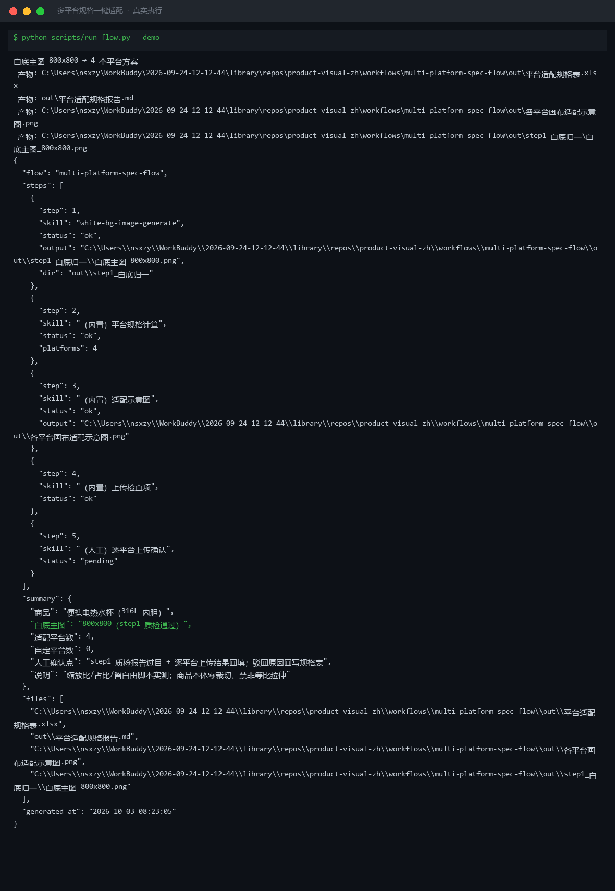

# 截图与录屏

> 以下素材均来自**真实执行**：`--run` 实拍终端 / 实跑产物文件，无摆拍。

## 演示视频


*四幕检测叙事（Hyperframes 动态渲染 17s）：业务钩子 → 真实执行 → 检查项逐条亮灯 → 交付物*

## 执行截图



## 实跑产物

| 文件 | 说明 |
|---|---|
| [`out/spec_flow_result.json`](out/spec_flow_result.json) | 结构化结果（实跑生成） · 2 KB |
| [`out/各平台画布适配示意图.png`](out/各平台画布适配示意图.png) | 图表产物（实跑生成） · 26 KB |
| [`out/平台适配规格报告.md`](out/平台适配规格报告.md) | Markdown 报告（实跑生成） · 1 KB |
| [`out/平台适配规格表.xlsx`](out/平台适配规格表.xlsx) | Excel 工作簿（实跑生成） · 7 KB |


---

## 附录：实跑输出明细

> 本资产为纯提示词客户端资产，无界面可截图。以下为**实跑运行效果**。

## 运行效果

### 输入

```json
{
  "input": "请提供工作流的初始输入数据"
}

```

### 输出

## 执行摘要

工作流因初始输入为占位符且执行步骤为空，无法执行多平台规格适配；已提示补充信息。

## 分步结果

1. 步骤 1：prompt.txt 中「执行步骤」部分为空，未定义任何原子技能串联逻辑，无法执行。

## 最终交付物

当前无法生成可直接使用的最终输出。存在两个问题：
1. input.json 为占位符，缺少主素材信息及各平台适配需求。
2. prompt.txt 中未填写执行步骤，缺少原子技能串联逻辑。

请补充：
- 初始输入数据：主素材描述、源尺寸、目标平台列表（如淘宝、京东、抖音、小红书等）
- 执行步骤：明确需要串联哪些原子技能（如白底图生成、尺寸裁剪、文案排版等）

*本内容由 AI 生成，最终交付物须带 AI 生成标识。*


---

*运行效果由实跑验证生成*
