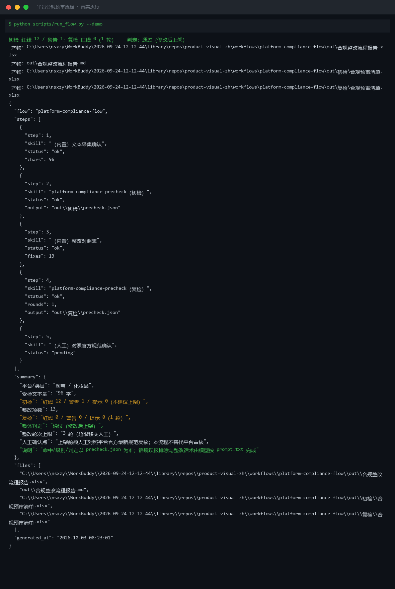
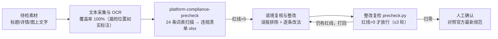

# 平台合规预审流程 Platform Compliance Flow

> 工作流（复合技能） ｜ 属于「商品视觉师」 ｜ 电商小卖家客群 ｜ T3 编排层（脚本 `run_flow.py`）
>
> **把上架前的合规检查变成可复跑、可留痕、可验收的流水线——红线不归零就不放行。**
> 编排 `platform-compliance-precheck`（24 条正则词表扫描 → Excel 违规清单）
> 整改复检闭环（复检红线 =0 才放行，最多 3 轮） · 语境误报逐条复核（事实陈述不误杀）
> 量化验收：警告 ≤2 且逐条有处置说明 · 受检文本 100% 采集不留静默漏检




🎬 **[▶ 观看高清完整版（mp4）](https://cdn.jsdelivr.net/gh/bangwozuo/product-visual-zh@main/workflows/platform-compliance-flow/docs/assets/demo.mp4)** — 四幕检测叙事：业务钩子 → 真实执行 → 检查项逐条亮灯 → 交付物

*上图来自真实执行：`python scripts/run_flow.py --demo`，淘宝/化妆品 96 字文案——初检红线 12 / 警告 1，整改 13 项后复检 1 轮归零，整体判定「通过（修改后上架）」。*

---

## 它编排什么（流程 DAG）

| # | 步骤 | 执行者 | 输出 | 失败处理 |
|---|---|---|---|---|
| 1 | 文本采集与 OCR | 内置/人工 | 受检文本全集（标题+详情+图上文字，注明来源） | OCR 不可用**退化为人工抄录，禁止跳过**——图上文字是极限词重灾区 |
| 2 | 词表扫描 | `platform-compliance-precheck` | `合规预审清单.xlsx` + `precheck.json`（分级命中） | 脚本退出码 ≠0 中止；类目词表为空按通用规则扫并标注 |
| 3 | 语境复核与整改 | 模型 | 误报排除说明 + 逐条整改文案 | 词表扫描不做语境判断（「最新款 iPhone」类事实陈述会被误报）——逐条复核；只删词不改事实，不给谐音/拆字规避写法 |
| 4 | 整改复检 | `platform-compliance-precheck` | 复检清单（预期红线 =0） | 仍有红线 → 打回步骤 3，最多 3 轮；超限判「不建议上架」移交人工 |
| 5 | 人工确认 | 人工 | 放行上架 / 继续修改 | 三份清单（初检/整改/复检）齐全才算交付 |



### 量化验收口径

| 项 | 阈值 | 说明 |
|---|---|---|
| 复检红线 | = 0 | 任一红线未清不得进入人工确认 |
| 复检警告 | ≤2 项且逐条有处置说明 | 保留理由或已保守化改写 |
| 整改轮次 | ≤3 轮 | 3 轮不归零说明描述本身违规，转人工 |
| 受检覆盖率 | 标题/详情/图上文字 100% | OCR 抄漏位置标「未采集」，不允许静默漏检 |

## 真实输入 → 真实输出

**输入**（`examples/input.json`）：淘宝/化妆品，96 字受检文案（含「全网最低价」「100% 彻底淡化痘印」「国家级」「加微信」等）+ 整改后文案用于复检。

**输出**（脚本实跑，节选）：

| 项 | 内容 |
|---|---|
| 初检 | 红线 12 / 警告 1 / 提示 0（不建议上架） |
| 整改项数 | 13 |
| 复检 | 红线 0 / 警告 0 / 提示 0（1 轮归零） |
| 整体判定 | 通过（修改后上架） |

整改对照表节选：

| # | 级别 | 原文片段 | 命中规则 | 建议改法 |
|---|---|---|---|---|
| 1 | 🔴 | 100% | 绝对化用语·功效断言 | 改「实测反馈良好（样本 30 人）」 |
| 4 | 🔴 | 抗敏 | 化妆品·医疗宣称 | 改「护理」「舒缓」等非医疗用词 |
| 9 | 🔴 | 加微信 | 淘宝·站外导流 | 删除导流信息，避免扣分 |
| 13 | 🟡 | 神器 | 营销强化词 | 保留但加限定语，如「2026 年新品」 |

留痕产物：`out/初检/合规预审清单.xlsx`、`out/复检/合规预审清单.xlsx`、`out/合规整改流程报告.xlsx`。

完整报告见 [`examples/output.md`](examples/output.md)。

## 快速开始

**方式一：提示词（任意 AI 工具）**

```text
1. 打开 prompt.txt，全文复制
2. 粘贴到 Coze / WorkBuddy / Dify / Claude / ChatGPT
3. 按 schema.json 输入规格提供：平台 + 类目 + 受检文本（标题+详情+图上文字）
   + 整改后文案（用于复检步）
```

**方式二：脚本（零 AI 依赖，全链路实测）**

```bash
# 演示模式（内置真实样例：初检 → 整改 → 复检闭环）
python scripts/run_flow.py --demo
# 指定输入
python scripts/run_flow.py --input examples/input.json --outdir out
```

依赖：`pip install pillow openpyxl`。

## 该用 / 别用

| ✅ 该用 | ❌ 别用 |
|---|---|
| 出图完成 → 上架前的最后一道合规流水线 | 替代法律意见（规则以平台官方公示为准） |
| 整改后复检闭环（红线归零才交付） | 红线未归零就给「可上架」结论 |
| 图上文字 OCR 全量采集（含人工抄录兜底） | OCR 缺失时假装已扫全部图上文字 |
| 只改表述不改商品事实信息 | 提供谐音/拼音/拆字/图片化等规避审核的写法（属违规协助） |

## 边界与合规

- 本工作流输出为 **AI 辅助生成内容**，不构成法律意见；上架前须人工对照平台官方最新规范
- 词表覆盖高频违规但可能滞后于平台更新——人工兜底确认
- 类目资质类表述（食品/化妆品/医疗器械）须法务或平台审核确认
- 不修改商品实质信息（价格、成分、规格）去「消灭」违规项

## 文件地图

```text
├── README.md                ← 本文件
├── SKILL.md                 ← 资产定义（元信息 / 契约 / 边界）
├── prompt.txt               ← 编排提示词本体（DAG + 验收口径 + 步骤明细）
├── schema.json              ← 输入输出契约（机器可读）
├── scripts/run_flow.py      ← 五步编排脚本（采集→扫描→整改→复检→报告）
├── examples/                ← 真实输入 + 脚本实跑输出
├── docs/                    ← 9 项配套文档（架构 / 流程 / 场景 / 测试报告…）
└── out/                     ← 实跑产物（初检/复检清单.xlsx / 合规整改流程报告）
```

---

*本资产遵循 [bangwozuo 数字员工资产规范](https://github.com/bangwozuo/digital-employee-spec) v3.0 ｜ [所属员工：商品视觉师](../../) ｜ [总入口](https://github.com/bangwozuo/digital-employees-hub-zh)*
