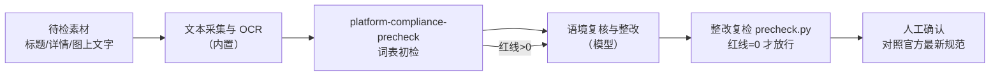

# 平台合规预审流程

把「上架前合规检查」变成**可复跑、可留痕、可验收**的流水线：初检 → 整改 →
**复检归零** → 人工确认。红线不归零不放行，三份清单（初检/整改对照/复检）齐全才算交付。

## 元信息

| 字段 | 值 |
|------|-----|
| ID | `de_ecom_01_wf03` |
| 类型 | **`composite`（复合技能/工作流）** |
| 所属员工 | 商品视觉师 |
| 阶段 | `P0` |
| 复杂度 | `S` |
| 触发方式 | 事件（出图完成 / 上架前） |
| ROI | 避免扣分限流的隐性损失 |
| 资产形态 | 可跑编排脚本 + 深度流程提示词（无模型调用依赖、无 API Key） |

## 编排的原子技能

| # | 原子技能 | 能力 |
|---|---------|------|
| 1 | [平台合规预审](../../skills/platform-compliance-precheck/) | 三类规则词表扫描（`scripts/precheck.py`，产出 Excel 违规清单） |

## 步骤链路（DAG）



## 步骤明细

| # | 步骤 | 技能资产 | 输入 | 输出 | 失败处理 |
|---|------|---------|------|------|---------|
| 1 | 文本采集与 OCR | （内置） | 标题/详情/图上文字 | 受检文本全集 | OCR 不可用退化为人工抄录，禁止跳过；文本为 0 中止 |
| 2 | 词表初检 | `platform-compliance-precheck` | 文本+平台+类目 | `out/初检/合规预审清单.xlsx` + precheck.json | 退出码≠0 或产物缺失中止；类目词表为空标注降级 |
| 3 | 语境复核与整改 | （模型） | 命中清单+原文 | 误报排除说明+整改文案 | 词表不做语境判断，误报逐条说明理由；不给规避写法 |
| 4 | 整改复检 | `platform-compliance-precheck` | 整改文案 | `out/复检/合规预审清单.xlsx` | 复检红线>0 打回步骤 3，≤3 轮；超限判「不建议上架」 |
| 5 | 人工确认 | （人工） | 三份留痕清单 | 放行上架 | 未确认不得上架；词表滞后由人工对照官方规范兜底 |

## 输入规格

| 字段 | 类型 | 必填 | 说明 |
|------|------|------|------|
| `text` | string | ✅ | 受检文本（标题+详情+图上文字 OCR，注明来源） |
| `platform` | string | ✅ | 淘宝/天猫/抖音/小红书/拼多多 |
| `category` | string | ⬜ | 化妆品/食品/保健品/医疗器械/母婴/教育/金融 |
| `revised_text` | string | ⬜ | 整改后文案；不提供则流程停在整改清单交付 |

## 输出规格

| 字段 | 类型 | 说明 |
|------|------|------|
| `summary` | object | 初检/复检三级计数、整改项数、轮次、整体判定 |
| `steps` | array | 各步骤执行状态与产物路径 |
| `deliverable` | file | `out/合规整改流程报告.xlsx`（初检清单/整改对照/复检清单/汇总，红线行标红） |

## 错误处理

| 情况 | 处理方式 |
|------|---------|
| precheck.py 退出码≠0 / 产物缺失 | 中止并打印 stderr，不静默失败 |
| 受检文本为空 | 中止（输入缺失），不产出空报告 |
| 复检红线未归零 | ≤3 轮循环；3 轮不归零判「不建议上架」移交人工 |
| 未提供 revised_text | 正常退出，复检标「未执行」，交付整改清单 |
| 词表漏检新违规词 | 人工确认环节兜底，词表维护记入 quality/tracking_log.md |

## 使用步骤

### 方式一：跑脚本（端到端闭环）

```bash
python3 <FLOW_DIR>/scripts/run_flow.py --input input.json --outdir out
python3 <FLOW_DIR>/scripts/run_flow.py --demo
```

### 方式二：手动编排（任意 AI 平台）

1. 用 `platform-compliance-precheck` 的 prompt 扫描受检文本得分级清单
2. 模型做语境误报排除并给整改文案（不改变商品实质信息）
3. 整改文案回同一词表复检至红线 0，三份清单交人工对照官方规范后放行

## 验收标准

- [x] DAG 节点为本仓真实技能 slug（platform-compliance-precheck）
- [x] 初检/复检同一脚本同词表，归零口径可复算
- [x] 整改轮次 ≤3、警告处置留痕、OCR 缺失不静默
- [x] 人工确认环节不可跳过，输出标注 AI 生成

## 边界（不做的事）

- ❌ 红线未归零不给出「可上架」结论
- ❌ 不提供谐音/拆字/图片化文字等规避审核的写法
- ❌ 不修改商品实质信息（价格/成分/规格）去消灭违规项
- ❌ 不替代平台官方审核，不构成法律意见

## 调用示例

**输入**（`examples/input.json`）：淘宝·化妆品精华液文案（含「全网最低价/100%/医美级/独家/销量第一/加微信」等 12 项红线），附整改后文案。

**输出**（run_flow.py 实跑，退出码 0）：初检红线 12 / 警告 1 → 整改对照 13 项 →
复检（第 1 轮）红线 0 → 判定**通过（修改后上架）**。
产物 `out/合规整改流程报告.xlsx` + `out/初检/`、`out/复检/` 两份预审清单。详见 `examples/output.md`。

## 所属工作流

本资产为复合技能（工作流），为独立上架前流程；词表能力由
`platform-compliance-precheck` 提供。

## 合规声明

- 本流程输出为 **AI 辅助预审结果**，交付前必须经人工复核，输出标注 AI 生成内容
- 平台规则以官方公示为准，本流程**不构成法律意见**
- 类目资质表述（食品/化妆品/医疗器械）须法务或平台审核确认

---

*本技能遵循 [bangwozuo 数字员工资产规范](https://github.com/bangwozuo/digital-employee-spec) v3.0*
