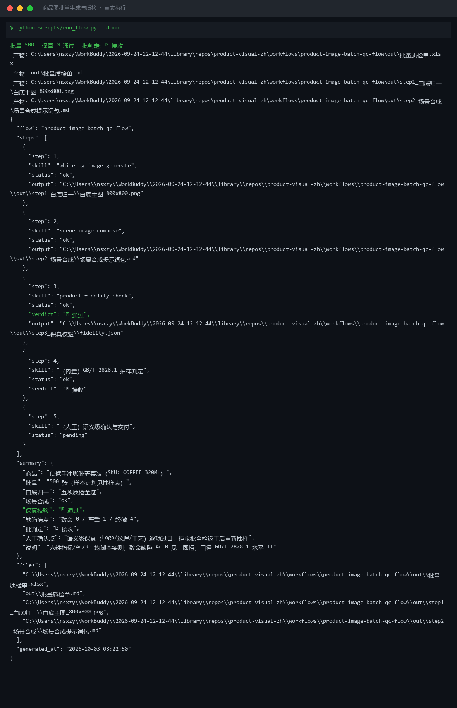
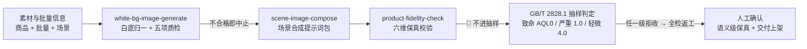
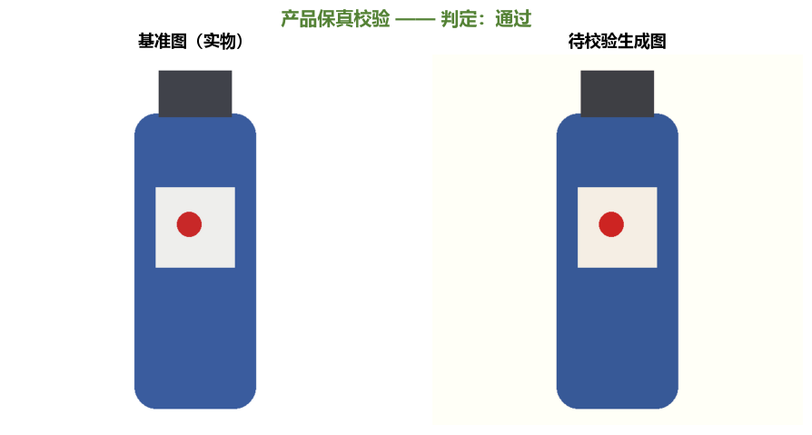

# 商品图批量生成与质检 Product Image Batch QC Flow

> 工作流（复合技能） ｜ 属于「商品视觉师」 ｜ 电商小卖家客群 ｜ T3 编排层（脚本 `run_flow.py`）
>
> **把一批商品图走完「生成 → 场景化 → 保真校验 → 抽样判定 → 交付」全链路，出一张有据可查的质检单。**
> 编排 3 个原子技能（white-bg / scene-compose / fidelity-check） · GB/T 2828.1 一般检验水平 II 抽样判定
> 三级缺陷 AQL（致命 0 / 严重 1.0 / 轻微 4.0） · 六维保真阈值固定 · 致命缺陷 Ac=0 见一即拒




*上图来自真实执行：`python scripts/run_flow.py --demo`，便携手冲咖啡壶套装批量 500 张——白底归一五项质检全过、保真校验通过、抽样 n=50 判定三级缺陷全接收 → 批判定 ✅ 接收。*

---

## 它编排什么（流程 DAG）

本流程把「一批商品图」从素材到交付一条链走完，编排以下原子技能：

| # | 步骤 | 执行者 | 输出 | 失败处理 |
|---|---|---|---|---|
| 1 | 白底归一 | `white-bg-image-generate` | 白底主图 + 五项质检报告 | 质检不合格 → 中止（不合格图不进批） |
| 2 | 场景提示词包 | `scene-image-compose` | 光影四参数 + 锁定词 + 验收清单 | 未提供场景需求 → 标「跳过，仅交付白底图」 |
| 3 | 保真校验 | `product-fidelity-check` | 六维指标 + 对比图 + 判定 | 🔴 需返工 → 该 SKU 停止交付，回出图环节 |
| 4 | 抽样判定 | 内置（GB/T 2828.1） | 样本量 n、Ac/Re、批接收/拒收 | 批量 >35000 → 标「超出本表按原表查」 |
| 5 | 人工确认 | 人工 | 交付上架 / 返工 | 拒收批 100% 全检后重检；致命缺陷 1 件整批停发 |



### 抽样判定口径（GB/T 2828.1 一般检验水平 II，正常检验一次抽样）

| 缺陷级别 | 定义 | AQL | 典型情形 |
|---|---|---|---|
| 致命 | 文字/价格错误，触碰合规红线 | 0（Ac=0 见一即拒） | 极限词、价格标错、Logo 错误 |
| 严重 | 影响使用与售卖判断 | 1.0 | 主体变形、ΔE00>3、结构缺失 |
| 轻微 | 不影响售卖判断 | 4.0 | 锐化过度、轻微毛边、留白偏差 |

批量 → 样本量（本表覆盖常用档）：91–150 → n=20；151–280 → 32（AQL≥1.0 时升至 50）；281–500 → 50；501–1200 → 80；1201–3200 → 125。逐级判定取**最严结果**。

### 保真校验六维阈值（固定）

| # | 指标 | 合格线 |
|---|---|---|
| 1 | 长宽比偏差 | ≤1.0%（>3.0% 判变形） |
| 2 | 主色 ΔE00 | <3.0（>6.0 视为不同色） |
| 3 | 边缘扩散宽度 | ≥0.5px（<0.2px 硬边锯齿） |
| 4 | 结构差异块占比 | ≤2.0%（>8% 成片被改） |
| 5 | 主体面积变化 | ≤1.0%（>5.0% 判缩放异常） |
| 6 | 语义级（Logo/纹理/工艺） | 人工逐项确认 |

## 真实输入 → 真实输出

**输入**（`examples/input.json`）：

```json
{
  "product": "便携手冲咖啡壶套装（SKU: COFFEE-320ML）",
  "batch_size": 500,
  "scene": {"light_dir": "upper-left", "color_temp_k": 3800, "canvas": "900x1200"},
  "defects": {"critical": 0, "major": 1, "minor": 4}
}
```

**输出**（脚本实跑，判定 ✅ 接收，节选）：

| 缺陷级别 | AQL | 样本量 n | Ac | Re | 抽检发现 | 判定 |
|---|---|---|---|---|---|---|
| 致命 | 0.0 | 50 | 0 | 1 | 0 | 接收 |
| 严重 | 1.0 | 50 | 1 | 2 | 1 | 接收 |
| 轻微 | 4.0 | 50 | 5 | 6 | 4 | 接收 |

全链路留痕：`out/step1_白底归一/`（白底主图 + 质检报告）、`out/step2_场景合成/提示词包.md`、`out/step3_保真校验/`（对比图 + 报告）、`out/批量质检单.xlsx`。

白底归一成品与保真对比图（脚本实跑产物）：

|  |  |
|---|---|
| step1 白底归一成品 | step3 保真校验对比图 |

完整报告见 [`examples/output.md`](examples/output.md)。

## 快速开始

**方式一：提示词（任意 AI 工具）**

```text
1. 打开 prompt.txt，全文复制
2. 粘贴到 Coze / WorkBuddy / Dify / Claude / ChatGPT
3. 按 schema.json 输入规格提供：商品 + 批量 + 场景需求（缺陷数抽检后回填）
```

**方式二：脚本（零 AI 依赖，全链路实测）**

```bash
# 演示模式（自动生成样例素材并跑通五步）
python scripts/run_flow.py --demo
# 指定输入
python scripts/run_flow.py --input examples/input.json --outdir out
```

依赖：`pip install pillow openpyxl`。

## 该用 / 别用

| ✅ 该用 | ❌ 别用 |
|---|---|
| 新品上架一批商品图的整批质检交付 | 保真校验未跑就判整批合格（最大忌讳） |
| 按国标口径收批/拒批（不「抽查几张看看」） | 致命缺陷混入交付批（1 件即整批停发） |
| 语义级保真人工过目 + 质检单留痕 | 编造缺陷数与检测数据（缺数标「待人工清点」） |
| 拒收批全检返工后重新抽样 | 拒收批不经全检直接二次交付 |

## 边界与合规

- 本工作流输出为 **AI 辅助生成内容**，交付上架由人工确认
- AI 生成图按平台规则标注，不得虚构实拍感、不作买家秀
- 保真校验是《广告法》第 28 条防虚假宣传的硬卡点
- GB/T 2828.1 为通用工业抽样标准，平台另有规范的以其为准

## 文件地图

```text
├── README.md                ← 本文件
├── SKILL.md                 ← 资产定义（元信息 / 契约 / 边界）
├── prompt.txt               ← 编排提示词本体（DAG + 抽样口径 + 步骤明细）
├── schema.json              ← 输入输出契约（机器可读）
├── scripts/run_flow.py      ← 五步编排脚本（白底→场景→保真→抽样→质检单）
├── examples/                ← 真实输入 + 脚本实跑输出
├── docs/                    ← 9 项配套文档（架构 / 流程 / 场景 / 测试报告…）
└── out/                     ← 实跑产物（step1 白底归一 / step2 场景 / step3 保真 / 批量质检单）
```

---

*本资产遵循 [bangwozuo 数字员工资产规范](https://github.com/bangwozuo/digital-employee-spec) v3.0 ｜ [所属员工：商品视觉师](../../) ｜ [总入口](https://github.com/bangwozuo/digital-employees-hub-zh)*
