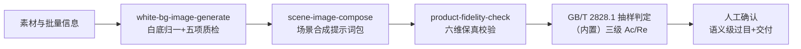

# 商品图批量生成与质检

把一批商品图走完**白底归一 → 场景化 → 保真校验 → 抽样判定 → 交付**全链路。
产出的是一张**样本量、缺陷数、接收/拒收**都有据可查的质检单，不是"这批图挺好"。

## 元信息

| 字段 | 值 |
|------|-----|
| ID | `de_ecom_01_wf01` |
| 类型 | **`composite`（复合技能/工作流）** |
| 所属员工 | 商品视觉师 |
| 阶段 | `P0` |
| 复杂度 | `M` |
| 触发方式 | 人工 |
| ROI | 月省 15h≈¥450 |
| 资产形态 | 可跑编排脚本 + 深度流程提示词（无模型调用依赖、无 API Key） |

## 编排的原子技能

| # | 原子技能 | 能力 |
|---|---------|------|
| 1 | [白底图生成](../../skills/white-bg-image-generate/) | 白底化 800×800 + 五项质检（scripts/white_bg.py） |
| 2 | [场景图合成](../../skills/scene-image-compose/) | 场景提示词包（光影四参数+锁定词，纯提示词技能） |
| 3 | [产品保真校验](../../skills/product-fidelity-check/) | 六维量化比对（scripts/fidelity_check.py） |

## 步骤链路（DAG）



## 步骤明细

| # | 步骤 | 技能资产 | 输入 | 输出 | 失败处理 |
|---|------|---------|------|------|---------|
| 1 | 白底归一 | `white-bg-image-generate` | 原图（或 demo 样例） | `out/step1_白底归一/` | 退出码≠0 或质检不合格 → 中止，不合格图不进批 |
| 2 | 场景提示词包 | `scene-image-compose` | 白底图描述+场景需求 | `out/step2_场景合成/提示词包.md` | 未提供场景需求 → 标「跳过，仅交付白底图」；出图由模型按其 prompt 执行 |
| 3 | 保真校验 | `product-fidelity-check` | 实物基准图 vs 成品图 | 六维指标 + `step3_保真校验/` | 🔴 需返工 → 该 SKU 整批停止交付（一票否决），脚本退出码≠0 中止 |
| 4 | 抽样判定 | （内置） | 批量 N + 各级缺陷数 | 样本量 n、Ac/Re、批接收/拒收 | 缺陷数缺失标「待人工清点」；批量 >35000 标「按原表查」 |
| 5 | 人工确认 | （人工） | 质检单全链路留痕 | 交付上架 | 拒收批 100% 全检返工后重新抽样；致命缺陷 1 件整批停发 |

## 保真校验阈值（fidelity_check.py 实测）

| # | 指标 | 合格线 |
|---|---|---|
| 1 | 长宽比偏差 | ≤1.0% |
| 2 | 主色 ΔE00（CIEDE2000） | <3.0 |
| 3 | 边缘扩散宽度 | ≥0.5px |
| 4 | 结构差异块占比 | ≤2.0% |
| 5 | 主体面积变化 | ≤1.0% |
| 6 | 语义级（Logo/纹理/工艺） | 人工逐项确认 |

## 抽样判定口径（GB/T 2828.1 水平 II）

| 缺陷级别 | 定义 | AQL | Ac 规则 |
|---|---|---|---|
| 致命 | 文字/价格错误等合规红线 | 0 | Ac=0，见一即拒 |
| 严重 | 变形、偏色 ΔE00>3、结构缺失 | 1.0 | n×AQL 落锚点（0.5→1，0.8→2，1.25→3，2.0→5，3.25→7…） |
| 轻微 | 锐化过度、轻微毛边 | 4.0 | 同上；如 n=50 → Ac5 Re6 |

批量→样本量（覆盖 91–3200 常用档）：91–150→20、151–280→32（AQL≥1.0 箭头升至 50）、
281–500→50、501–1200→80、1201–3200→125。任一级拒收 → **整批拒收**（全检返工后重抽）。

## 输入规格

| 字段 | 类型 | 必填 | 说明 |
|------|------|------|------|
| `product` | string | ✅ | 商品名 / SKU |
| `batch_size` | number | ✅ | 本批图数量 |
| `scene` | object | ⬜ | 场景需求：description / light_dir / color_temp_k / canvas |
| `source_image` / `reference_image` | string | ⬜ | 原图与实物基准图；不提供则脚本用内置样例跑通 |
| `defects` | object | ⬜ | 人工清点回填：critical / major / minor |

## 输出规格

| 字段 | 类型 | 说明 |
|------|------|------|
| `summary` | object | 批量、保真判定、缺陷清点、批判定、人工确认点 |
| `steps` | array | 各步骤状态与产物路径 |
| `deliverable` | file | `out/批量质检单.xlsx`（抽样判定/保真指标/汇总）+ md 报告 |

## 错误处理

| 情况 | 处理方式 |
|------|---------|
| batch_size 缺失/非法 | 中止 |
| 上游脚本退出码≠0 / 产物缺失 | 中止并打印 stderr |
| 白底质检不合格 / 保真 🔴 | 中止该批（一票否决），报告路径写进错误信息 |
| 缺陷数未回填 | 抽样标「待人工清点」，判「待清点后判」 |
| 任一级拒收 | 判「❌ 拒收（100% 全检返工）」 |

## 使用步骤

### 方式一：跑脚本（端到端）

```bash
python3 <FLOW_DIR>/scripts/run_flow.py --input input.json --outdir out
python3 <FLOW_DIR>/scripts/run_flow.py --demo
```

### 方式二：手动编排（任意 AI 平台）

1. 用 white-bg-image-generate 归一并质检白底图；用 scene-image-compose 出场景提示词包
2. 出图后用 product-fidelity-check 对实物基准做六维校验（🔴 即停）
3. 按 GB/T 2828.1 水平 II 定 n、Ac/Re，人工清点缺陷后逐级判定，拒收全检返工

## 验收标准

- [x] DAG 节点为本仓真实技能 slug（white-bg-image-generate / scene-image-compose / product-fidelity-check）
- [x] 六维阈值、抽样表、Ac/Re 全部脚本实测可复算
- [x] 保真 🔴 一票否决与致命缺陷零容忍均有代码路径
- [x] 拒收批全检返工、语义级人工过目环节不可跳过

## 边界（不做的事）

- ❌ 保真校验未跑不判整批合格；语义级 6 项不写"合格"，写"待人工确认"
- ❌ 抽样量不达标不下"这批没问题"的结论
- ❌ 致命缺陷混入交付批；拒收批不经全检返工直接二次交付
- ❌ 不编造缺陷数与检测数据；缺数标「待人工清点」
- ❌ 平台对内容另有规范的以其为准；AI 生成图按平台规则标注

## 调用示例

**输入**（`examples/input.json`）：便携手冲咖啡壶套装，批量 500，晨光场景提示词包，
抽检缺陷 致命 0 / 严重 1 / 轻微 4。

**输出**（run_flow.py 实跑，退出码 0）：白底五项质检全过 → 保真 ✅ 通过 →
抽样：n=50，致命 Ac0 见 0 收、严重 Ac1 见 1 收、轻微 Ac5 见 4 收 → **批判定：接收**。
产物 `out/批量质检单.xlsx` + md + 全链路留痕目录。详见 `examples/output.md`。

## 所属工作流

本资产为复合技能（工作流），为出图交付的总质检环节；能力分别由
`white-bg-image-generate`、`scene-image-compose`、`product-fidelity-check` 提供。

## 合规声明

- 本流程输出为 **AI 辅助质检单**，语义级保真与最终交付由人工确认，输出标注 AI 生成内容
- 保真校验是《广告法》第 28 条防虚假宣传的硬卡点；AI 生成图按平台规则标注
- GB/T 2828.1 为通用工业抽样口径，平台或品牌方另有验收规范的以其为准

---

*本技能遵循 [bangwozuo 数字员工资产规范](https://github.com/bangwozuo/digital-employee-spec) v3.0*
